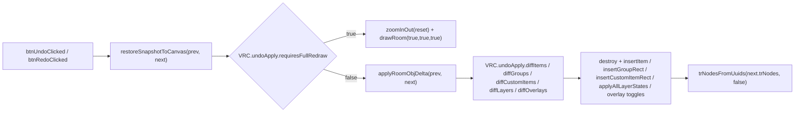
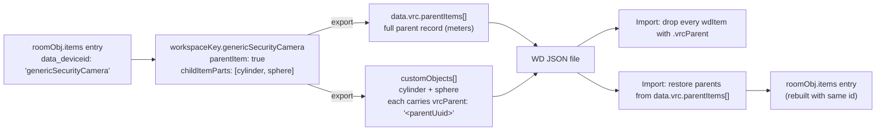
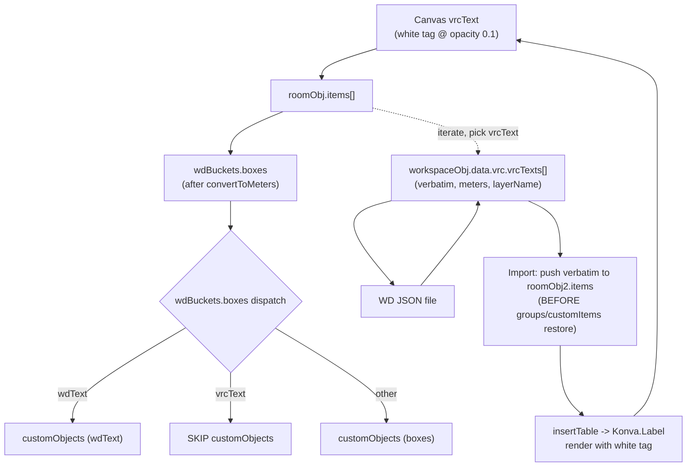

# Video Room Calculator - Developer Reference

## Overview

The **Video Room Calculator** is a web-based tool for designing Cisco video collaboration room layouts. It provides a 2D canvas for placing equipment (cameras, microphones, displays, tables, chairs) and integrates with Cisco's Workspace Designer for 3D visualization.

**Author:** Joe Hughes (Cisco)
**Version:** v0.1.631
**License:** MIT NON-AI

---

## Project Structure

```
video_room_calculator/
├── RoomCalculator.html      # Main entry point
├── style.css                # Styles with CSS custom properties
├── CLAUDE.md                # This developer reference
├── README.md                # Release notes & user-facing docs
├── FAQ.md                   # Frequently asked questions
├── LICENSE                  # MIT NON-AI license
├── notes/                          # Lazy-loaded references (not in CLAUDE.md context)
│   ├── GIT_WORKFLOW.md             # Branching, tagging, day-to-day cheatsheet
│   ├── TECH_NOTES.md               # Engineering notes & refactor targets
│   ├── TECH_NOTES_KONVA.md         # Konva.js footguns specific to this codebase
│   ├── KONVA.md                    # Konva.js API/CSS cheat sheet (companion to footgun file)
│   ├── URL_ENCODING.md             # `?x=…` shareable-link format (items / layers / groups)
│   ├── WORKSPACE_DESIGNER.md       # Cisco WD JSON round-trip (incl. Group block)
│   ├── XCONFIG.md                  # Cisco xConfiguration .txt import + export
│   ├── DXF_EXPORT.md               # AutoCAD R12 DXF export (layers, blocks, internals)
│   ├── UI_LAYOUT.md                # HTML structure + CSS organization quick map
│   ├── TEMPLATES.md                # Templates system blurb
│   ├── KEYBOARD_SHORTCUTS.md       # Canonical keyboard shortcut list
│   └── DEPENDENCIES_AND_ISSUES.md  # External CDN deps + common issues cheat sheet
├── js/
│   ├── konva.min.js         # Canvas rendering library (third party, minified)
│   ├── constants.js         # Global constants + window.VRC namespace bootstrap (loaded first)
│   ├── data/
│   │   ├── workspaceKey.js  # Workspace Designer object map (Phase 2 extract; window.VRC.workspaceKey)
│   │   └── certifiedDisplays.js # Certified-display catalogue (window.VRC.certifiedDisplays; APPEND-ONLY — see "Certified Display item" below)
│   ├── util/
│   │   ├── uuid.js          # createUuid() (Phase 2 extract; window.VRC.util)
│   │   └── units.js         # convertToUnit / convertToMeters / convertMetersFeet (Phase 2 extract; window.VRC.util)
│   ├── undoApply.js         # VRC.undoApply diff helpers for incremental undo/redo restore (Konva-free; see "Incremental undo/redo restore" below)
│   ├── idbStorage.js        # IndexedDB wrapper (undo/redo + bg image library + VRC Custom Item Library)
│   ├── roomcalc.js          # Core application logic (~26,000 lines)
│   ├── templates.js         # Pre-built room templates             (eager-loaded so the New Room dialog opens with tiles populated)
│   ├── qrcode.js            # QR code generation                   (lazy-loaded — first QR render)
│   ├── drpDownOverride.js   # Dropdown UI for RoomOS               (lazy-loaded — RoomOS only)
│   ├── dxfWriter.js         # DXF (CAD) writer                     (lazy-loaded — first DXF export)
│   └── dxfBlockLibrary.js   # DXF symbol block library             (lazy-loaded — first DXF export)
├── data/                    # Device specifications
│   ├── README.md            # Documentation for data files
│   ├── videoDevices.json    # Video device specs
│   ├── cameras.json         # Camera specs
│   └── microphones.json     # Microphone & navigator specs
├── assets/
│   ├── images/              # 173 device/furniture images
│   │   └── templates/       # Template preview images
│   ├── Inter-VariableFont.ttf
│   ├── MomentumFontIcon.woff2
│   ├── momentum-icons.css
│   └── favicon.ico
```

There is no build step. Open `RoomCalculator.html` directly in a browser.

The eager-loaded `<script>` order is `konva.min.js` → `constants.js` →
`data/workspaceKey.js` → `data/certifiedDisplays.js` → `util/uuid.js` →
`util/units.js` → `undoApply.js` → `idbStorage.js` → `templates.js` →
`roomcalc.js`. Every
module before `roomcalc.js` attaches to the shared `window.VRC` namespace
(per the convention in `notes/TECH_NOTES.md`); `roomcalc.js` then aliases
the public names back into local `const` bindings near the top of the
file so existing call sites stay unchanged. See the Phase 2 header
comment in `roomcalc.js` and the IIFE pattern note in
`js/data/workspaceKey.js`. `templates.js` is plain data (`const templates
= [...]`) and carries no `VRC` surface — it is eager-loaded so the New
Room dialog can render its tiles synchronously the first time it opens.

The lazy-loaded scripts (`qrcode.js`, `drpDownOverride.js`,
`dxfWriter.js`, `dxfBlockLibrary.js`, `migrateLegacyItemsShape.js`) are
pulled in on demand by `loadScriptOnce()` and are *not* listed in
`RoomCalculator.html`.

`notes/TECH_NOTES.md` documents the long-term refactor direction. Read it
before doing structural changes. `notes/GIT_WORKFLOW.md` describes the
`main` / `next` branching model.

---

## Technology Stack

| Technology | Purpose |
|------------|---------|
| **Vanilla JavaScript** | Core application logic |
| **Konva.js** | HTML5 Canvas rendering, drag-and-drop, transformations |
| **DOMPurify** | HTML sanitization (loaded via CDN) |
| **CSS3** | Styling, responsive design, animations |
| **SVG** | Some icons and graphics |

---

## Architecture

### Core Data Structure: `roomObj`

The entire room state is stored in a single object (`roomObj`) defined in `roomcalc.js:77-108`:

```javascript
roomObj = {
  roomId: "uuid",           // Unique room identifier
  name: "Room Name",        // Display name
  version: "v0.1.631",      // App version
  unit: "feet",             // "feet" or "meters"
  room: {
    roomWidth: 26,          // In current unit
    roomLength: 20,
    roomHeight: ""          // Optional
  },
  software: "",             // "mtr" or "webex"
  authorVersion: "",        // User-defined version
  items: [                  // FLAT array. Each item's category is derived
                            // dynamically from
                            // allDeviceTypes[item.data_deviceid].parentGroup
                            // (e.g. 'videoDevices' / 'chairs' / 'tables' / ...) —
                            // there is NO bucket-by-category map here.
                            // Insertion order is preserved; no sorting at write
                            // time. Legacy `.vrc.json` files that carry the
                            // older `items: { videoDevices: [...], ... }` shape
                            // are auto-migrated on read via
                            // `js/migrateLegacyItemsShape.js` (see "Legacy
                            // items shape migration" below).
    { data_deviceid: "roomBarPro", id: "uuid", x: 1.2, y: 3.4, /* ... */ },
    { data_deviceid: "tblRect",    id: "uuid", x: 2.5, y: 4.5, /* ... */ }
    // ...
  ],
  workspace: {
    removeDefaultWalls: false,
    addCeiling: false
  },
  roomSurfaces: {           // Wall configurations
    leftwall: { type: 'regular', acousticTreatment: true },
    videowall: { type: 'regular', acousticTreatment: false },
    rightwall: { type: 'regular', acousticTreatment: false },
    backwall: { type: 'regular', acousticTreatment: false }
  },
  overlaysVisible: {           // visibility of the 5 coverage/visualization overlays + gridlines
    cameraCoverage: true,      // (NOT related to roomObj.layers / VRC Layers — historical misnomer was `layersVisible`)
    displayDistanceCoverage: true,
    microphoneCoverage: true,
    speakerCoverage: true,
    gridLines: true,
    overlayLabels: false
  },
  layers: [                   // VRC Layer system for organizing items (distinct from Konva layers)
    { name: 'Default',  visible: true, locked: false, layerid: '0' },   // reserved - cannot be deleted
    { name: 'Ceiling',  visible: true, locked: false, layerid: '1' },   // reserved - cannot be deleted
    { name: 'Furniture', visible: true, locked: false, layerid: 'uuid' } // custom layers use createUuid()
  ],
  // items carry an optional data_layerId = layerid string; omitted for Default layer ('0')
  groups: [                   // VRC Group system (PowerPoint-style grouping)
    {
      groupid: "uuid",
      name: "Group 1",
      data_layerId: "0",      // VRC layer shared by all members (matches item.data_layerId convention)
      x: 1.5,                 // bounding rect top-left, in current unit
      y: 3.84,
      width: 2.5,
      height: 3.5,
      rotation: 0,
      data_zPosition: 0,      // lowest z-position of members
      groupMembers: ["item-uuid-1", "item-uuid-2"]
    }
  ]
  // items carry an optional data_groupId = groupid string; omitted if not in a group
}
```

### Legacy items shape migration

Pre–May 2026 `roomObj.items` was an object-of-arrays keyed by
`parentGroup`:

```javascript
items: { videoDevices: [], chairs: [], tables: [], stageFloors: [],
         boxes: [], displays: [], speakers: [], microphones: [],
         touchPanels: [] }
```

That bucket structure was a cache — `allDeviceTypes[item.data_deviceid].parentGroup`
is the actual source of truth for an item's category. The current
shape is a flat array; the buckets are removed entirely.

Backward compatibility is transparent. Three load paths can encounter
the legacy shape:

| Load path | Where | Behaviour |
|-----------|-------|-----------|
| `.vrc.json` file import | `importJson()` in `js/roomcalc.js` | Inline shape check; if legacy, lazy-loads `js/migrateLegacyItemsShape.js` via `loadScriptOnce(VRC.constants.SCRIPT_MIGRATE_LEGACY_ITEMS)`, runs the migration, then continues the import. |
| IndexedDB undo/redo hydration | Boot IIFE in `js/roomcalc.js` (after `idbReady.then(...)`) | Walks `undoArray` + `redoArray`; if any entry has the legacy shape, lazy-loads the helper and runs `window.VRC.migrateLegacyItemsShape(entry)` across both arrays before `onLoad()`. |
| Shareable URL parser | `parseShortenedXYUrl()` | Builds the flat array directly; no migration needed. |

`js/migrateLegacyItemsShape.js` exposes a single function
`window.VRC.migrateLegacyItemsShape(obj)`:

- No-op if `obj.items` is already an array.
- Otherwise flattens the bucket map into a single array (insertion
  order across buckets is preserved by iterating `for..in` in
  declaration order).
- Logs `[VRC] Migrating legacy items shape …` once per session via a
  module-local sentinel.

Helpers for working with the flat shape:

- `getItemsByParentGroup('videoDevices')` — filter (O(n)).
- `firstItemOfParentGroup('videoDevices')` — first match (O(n) until
  hit).
- `countItemsByParentGroup('videoDevices')` — count (O(n)).
- `bucketItemsByParentGroup(obj?)` — one O(n) pass that returns
  `{ videoDevices: [], chairs: [], ... }` for callers that need
  multiple buckets at once (WD export, xConfig export, etc.).

**Performance rules (locked in by the flatten refactor):**

1. **Multi-category reads MUST bucket once.** Any function that
   reads 2+ parentGroups calls `bucketItemsByParentGroup()` once at
   the top — O(n) total — rather than calling
   `getItemsByParentGroup()` N times (which would be O(N×n)).
2. **`updateRoomObjFromTrNode()` push branch MUST NOT linear-scan.**
   The function uses `roomObjItemsMap.get(node.id())` at the top; if
   the map says "not found", it just pushes to `roomObj.items` and
   registers the new entry in the map — no `findIndex` scan.
3. **Single-item shading toggles MUST use the map directly.**
   `toggleMicShadingSingleItem`, `toggleSpeakerShadingSingleItem`,
   `toggleCamShadeSingleItem`, `toggleDisplayDistanceSingleItem` all
   call `roomObjItemsMap.get(id)` — O(1) instead of O(b) plus a sync
   DOM read of the (now removed) `#itemGroup` textbox.

The canvas uses multiple Konva layers for rendering (defined around line 57-500):

| Layer | Purpose |
|-------|---------|
| `stage` | Main Konva stage container |
| `layerGrid` | Grid lines and room outline (true `Konva.Layer`) |
| `layerBackgroundImageFloor` | Floor plan background images (actually a `Konva.Group` despite the name — see [notes/TECH_NOTES.md](notes/TECH_NOTES.md) §6) |
| `layerTransform` | All draggable objects (true `Konva.Layer`) |
| `layerSelectionBox` | Selection rectangle (true `Konva.Layer`) |

The next five live inside `layerTransform` as `Konva.Group`s, not as their own `Konva.Layer`s. They are toggled via `roomObj.overlaysVisible` (see `overlaysVisible` in the `roomObj` shape above). Each variable name, the Konva `name:` attribute, and the matching key in `overlaysVisible` are all the same string — the dynamic dispatch in `applyAllLayerStates` relies on it.

| Konva.Group (variable / `name:` / `overlaysVisible` key) | Purpose |
|----------------------------------------------------------|---------|
| `cameraCoverage` | Camera FOV visualization |
| `microphoneCoverage` | Microphone coverage visualization |
| `speakerCoverage` | Speaker coverage visualization |
| `displayDistanceCoverage` | Display viewing-distance lines |
| `overlayLabels` | Item label tooltips |

### Groups (within layerTransform)

| Group | Purpose |
|-------|---------|
| `groupVideoDevices` | Cameras, Room Bars, Boards |
| `groupMicrophones` | Table/Ceiling mics |
| `groupChairs` | Chairs and seating |
| `groupTables` | Tables and surfaces |
| `groupDisplays` | Screens and monitors |
| `groupStageFloors` | Stage/floor elements |

---

## Critical Data Flow: Item Updates

**IMPORTANT:** When adding new `data_*` attributes to items, you must update THREE places:

### Flow: Item Update → Konva Node → roomObj

1. **User clicks Update** → `updateItem()` reads form values
2. **Node rebuilt** → `insertShapeItem()` or `insertTable()` creates Konva node
3. **Custom data added** → `data_*` attributes set on the Konva node object
4. **Sync to roomObj** → `canvasToJson()` reads `data_*` from nodes and writes to `roomObj.items`

### Adding a new data_* attribute requires changes in:

| Location | Function | Purpose |
|----------|----------|---------|
| `insertShapeItem()` ~line 9831 | `imageItem.data_xxx = attrs.data_xxx` | Set on Konva node for non-table items |
| `insertTable()` ~line 7793 | `tblWallFlr.data_xxx = attrs.data_xxx` | Set on Konva node for tables/walls |
| `canvasToJson()` → `updateRoomObjFromTrNode()` | `itemAttr.data_xxx = node.data_xxx`, then `roomObj.items.push(itemAttr)` (new item) or patch on the existing `roomObjItemsMap.get(id)` entry | Read from node, write to the flat `roomObj.items` array. The legacy nested `getNodesJson()` was removed in May 2026 when `roomObj.items` was flattened — see the short pointer comment in `canvasToJson()`. |
| `copyToCanvasClipBoard()` | `newAttr.data_xxx = node.data_xxx` | Preserve during copy/paste |

### Why this matters:
- Konva only supports standard attributes (x, y, width, rotation, etc.)
- Custom `data_*` attributes are stored directly on the node object
- `canvasToJson()` calls `updateRoomObjFromTrNode()`, which syncs the current `tr.nodes()` selection back to `roomObj.items` (the source of truth). For brand-new items (e.g. just pasted), this is the *only* writer that creates the `roomObj.items[]` entry, so the field MUST be added to its `itemAttr` builder. Mirror it on both code paths inside that function: the `roomObjItemsMap.get(...)`-hit branch (existing item — patch on the existing entry) AND the `else` branch (new item — push a fresh `itemAttr`).
- If you skip any step, the attribute will appear to save but then disappear when clicking another item, OR — more subtly — round-trip correctly for items created in-place but vanish for items created via paste/duplicate (the bug pattern that broke group URL persistence on copy/paste in May 2026).

Recent example: `data_fontSize` (wdText / vrcText text items) follows the same four-place rule — wired into `insertTable()`, the defensive mirror in `insertShapeItem()` → `updateNodeAttributes()`, the push + map-hit branches in `updateRoomObjFromTrNode()`, and `copyToCanvasClipBoard()`. The Details-panel form input is read in `updateItem()` under the `isTextItem(item.data_deviceid)` branch (single helper that returns `true` for both `wdText` and `vrcText` — see "VRC-only text item (vrcText)" below).

---

## Configurable Fill & Opacity (configurableColor / wdOpacity)

Items whose device definition carries `configurableColor: true` and / or
`wdOpacity: true` can have their canvas fill and opacity overridden
per-item via the compact `#fillDiv` row in the Details panel.

Current participants:

| Item | configurableColor | wdOpacity | Device default fill | Device default opacity |
|------|-------------------|-----------|---------------------|------------------------|
| `box`         | ✓ | ✓ | `#FFFFFF99` | 1 |
| `carpet`      | ✓ | ✓ | `#FFFFFF99` | 1 |
| `stageFloor`  | ✓ | ✓ | `#FFFFFF99` | 1 |
| `wallStd`     | ✓ | ✓ | `gray`      | 0.8 |
| `columnRect`  | ✓ | ✓ | `gray`      | 0.8 |
| `cylinder`    | ✓ | ✓ | `grey`      | 0.4 (device-def `opacity`) |
| `cone`        | ✓ | ✓ | `grey`      | 0.4 (device-def `opacity`) |
| `sphere`      | ✓ | — | radial gradient (`white → grey → grey`) | 0.8 |
| `pathShape`   | ✓ | ✓ | `#D3D3D3` (with `data_labelField` JSON `"color"` / `"opacity"` as a secondary fallback — see "pathShape precedence" below) | device-def `opacity` (currently `1 / scale`-driven local default ≈ `0.8` after the `wdOpacity` adjustment chain) |
| `wdText`      | ✓ | — | (canvas: blue tag `#588ce5ff` with white text — not affected by the picker; WD-export `color` defaults to `"black"` and IS driven by the picker) | n/a |
| `vrcText`     | ✓ | ✓ | (canvas: white tag with `opacity: 0.1` — not affected by the picker; the picker drives the inner text fill / opacity, same as wdText) | n/a |

Each Konva-rendering branch reads `attrs.data_fill || <device-default>`
for fill and `(attrs.data_opacity == null ? <device-default> :
Number(attrs.data_opacity))` for opacity. The device defaults are the
historical hardcoded values, so when the user clicks Reset (which
triggers a rebuild with `data_fill` / `data_opacity` deleted), the item
falls back to exactly what it looked like before configurable color
existed.

### Concept

- `configurableColor: true` → device exposes a native HTML5 color picker
  in the Details panel; the user's pick is stored as
  `item.data_fill = '#RRGGBB'` and overrides the rect's Konva `fill`.
- `wdOpacity: true` → device exposes an opacity number input (0–1 with
  0.01 precision); stored as `item.data_opacity = <number>` and overrides
  the rect's Konva `opacity`. Default (1.0) ⇒ attribute omitted entirely.

Both attributes are **absent ⇒ device default**. The "reset" button
(`#btnFillReset`, `resetFillToDefault()`) sets the picker back to
`#FFFFFF` and opacity to `''`, then routes through `updateItem()`,
which deletes both attrs and rebuilds the Konva node — the rebuilt
node picks up the device defaults via the `|| <default>` fallback in
each rendering branch.

### Sphere gradient (configurableColor-only)

Sphere is rendered as a Konva.Shape with a radial gradient set inside
`sceneFunc`. The body color reads `shape.data_fill || 'grey'` at draw
time. The inner stop stays `white` so the 3D highlight effect is
preserved even when the sphere is tinted to a custom color. Sphere is
intentionally `configurableColor: true` only (no `wdOpacity`) — the
device-def fallback opacity (0.8) renders the sphere with a soft, semi-
transparent body that matches the original look.

`shape.data_fill` is populated by the four-place rule writer line
(`tblWallFlr.data_fill = attrs.data_fill || null`) which runs AFTER
the `new Konva.Shape({...})` constructor but BEFORE the first redraw,
so the `sceneFunc`'s read sees the correct value on every draw,
including the very first one.

### Cone (cylinder variant with `data_radius2`)

`cone` is a sibling of `cylinder`. WD has no native cone object so
the export rides the existing `cylinder` `objectType` and adds a
`radius2` attribute; on import a `cylinder` carrying `radius2` is
re-routed to `cone` after the scoring loop in `wdItemToRoomObjItem()`.

| Surface | Convention |
|---------|------------|
| `data_deviceid` | `'cone'` |
| URL key (item prefix) | `WQ` (next free `W_` slot at the time — `WL` is pathShape, `WM` is credenza, `WN` is tblBullet, `WO`/`WP` are wallChairs* variants; `wdText` later moved to `WR` after the duplicate-`WM` collision with credenza was discovered) |
| URL per-item attribute | `y{N}` where N = `data_radius2 × 100` in current unit (mm in meters mode, hundredths of a foot in feet mode). Decoder gates on `data_deviceid === 'cone'`; `y` continues to mean `data_lineWidth` for `dimensionLine` items. |
| `roomObj.items` shape | `item.width = 2 × radius1` (cylinder convention; `item.height` is forced equal to `item.width` in `updateItem()`); `item.data_radius2 = <radius2>` (raw radius value, not a diameter). |
| Konva render | Single `Konva.Shape` with `sceneFunc` that draws two concentric ellipses — outer radius = `width / 2` (in pixels, since `shape.getAttr('width')` is already pixel-converted), inner radius = `data_radius2 × scale` (where `scale` is pixels-per-current-unit, the same global other items use to convert `attrs.width` → pixels via `attrs.width * scale`). Each `fillStrokeShape` call paints both fill and stroke; the overlap doubles the effective opacity inside the inner circle, producing the "filled inner disc + outer ring" look from the menu image. **DO NOT use `unitScale`** — that variable is `scale * 3.28084` in feet mode (pixels-per-meter, used for meters-anchored minimums elsewhere). Using `unitScale` would render `data_radius2` as if it were a meter value, blowing the inner circle up by ~3.28× in feet mode (the bug fixed in v0.1.65x). |
| `getSelfRect` override | The cone branch overrides `tblWallFlr.getSelfRect` to return `{x: -offset, y: -offset, width: d, height: d}` where `d = max(width, 2 × data_radius2 × scale)`. Without this, when `radius2 > radius1` the visible outer circle would extend beyond the Konva-default `{0, 0, width, height}` bounding box and the Transformer / hit detection would clip to the smaller width-derived box. Same `scale`-vs-`unitScale` rule as the `sceneFunc`. |
| Resize handles | None. `enableCopyDelBtn()` routes cone selections to `tr.resizeEnabled(false)` (its own branch — sibling to the sphere/cylinder/columnRect branch that does enable a `bottom-right` anchor). Cones are resized exclusively by typing into the Radius / Radius2 inputs in the Details panel, since both radii are independent of each other (and either can be larger). |
| Details panel | "Width" relabels to "Radius" (the input shows `width / 2`); "Length" hidden (a circle has no second axis); a new "Radius2" input is shown for cone, populated from `data_radius2`. `updateFormatDetails()` is split into TWO cone blocks: the early block (just below the panel-show switch) toggles label text + length-div / radius2-div visibility; the late block (immediately after the canonical `itemWidth.value = round(shape.width()/scale)` line and the dimensionLine override) writes the half-of-width value into the Radius input AND fills the Radius2 input. Splitting was required because the early block's value-write was being clobbered by the canonical assignment (the bug fixed in v0.1.65x). `updateItem()` reads the radius input and writes `item.width = 2 × radius1`, then forces `item.height = item.width` via the existing `sphere/cylinder/cone` branch. |
| WD export | `workspaceObjWallPush()` cone branch: `objectType: 'cylinder'`, `radius`, `radius2`, `length` (from `data_vHeight` or room height), and the standard tilt/rotation/slant rotation triple. `width`/`height` are deleted before push. WD JSON is meters-only, so `convertToMeters()` (in [js/util/units.js](js/util/units.js)) MUST scale `data_radius2` by `ratio = 1/3.28084` in feet mode — same as it does for `width`/`height`/`data_vHeight`. The companion `convertItemUnitBasedOnRatio()` (used by the in-app feet↔meters toggle) already includes `data_radius2`; the two paths must stay in sync. |
| WD import | Post-scoring override at the end of the WD import loop converts `wdItem.objectType === 'cylinder' && 'radius2' in wdItem` to `candidateKeyName = 'cone'`. The width/height/data_vHeight/position branches all extend the existing cylinder cases to cover cone, and a final block deletes both `wdItem.radius` and `wdItem.radius2` so they don't survive into `roomObj.items`. |
| Defaults | Radius = 0.1 m (0.33 ft), Radius2 = 0.3 m (0.98 ft), Height (data_vHeight) = 0.8 m (2.63 ft). Defaults are applied in three places: (1) `insertTable()` width default (`width = 0.2 × scale` → diameter 0.2 m → radius1 0.1 m); (2) the cone `else if` branch in `insertTable()` (sets `tblWallFlr.data_radius2` when `attrs.data_radius2 == null`); (3) the cone device-def has `default_vHeight: 800` (mm), which `insertItemFromMenu()` reads and writes to `attrs.data_vHeight` BEFORE the `roomObj.items.push(attrs)` so the value survives the first canvasToJson cycle. **Why no insertTable() default for `data_vHeight`?** Because `updateRoomObjFromTrNode()`'s patch branch (the map-hit code that runs when an item is already in `roomObjItemsMap`) does NOT mirror `data_vHeight` from the Konva node back into the roomObj item — only the push branch carries `data_vHeight` forward via the initial `attrs`. A Konva-node-only `data_vHeight` default in `insertTable()` would be lost on the very next canvasToJson, leaving the Details panel showing a blank Height field with the room-height placeholder. The Equipment menu does NOT expose a cone tile (see "Menu absence" below); these defaults fire on Quick Add insertion and on `.vrc.json` / URL / WD import paths. |
| Menu absence | Cone is **not** in the `wallsMenu` array in `createItemsOnMenu` — the user cannot add a fresh cone from the Equipment menu. The device definition remains in `allDeviceTypes` so cones loaded from existing `.vrc.json` files, shareable URLs (`WQ` prefix), and WD imports (the `cylinder + radius2` post-scoring override in `wdItemToRoomObjItem()`) continue to render and round-trip cleanly. To re-enable the menu tile, add `'cone'` back to `wallsMenu` (around line 23942 of `js/roomcalc.js`). |
| 0.999 opacity sentinel | Inherited from pathShape — see "cone-only WD opacity sentinel (`0.999`)" above. Same export clamp, same import-side snap-back. |

### pathShape precedence

`pathShape` is a first-class participant in the `configurableColor` /
`wdOpacity` system, but its `insertTable()` branch still understands the
legacy `data_labelField` JSON `{"color":"…","opacity":…}` shape as a
fallback (xConfig Arrows and hand-authored Item-Label JSON depend on
this). Precedence at render time (symmetric for fill and opacity):

```
attrs.data_fill      || (label-JSON "color")    || '#D3D3D3'
attrs.data_opacity   ?? (label-JSON "opacity")  ?? device-def opacity
```

The Details panel inputs always win — picker > label-JSON > device
default. Items created without a picker hex (xConfig Arrows, legacy
pathShapes) keep rendering exactly as before via the label-JSON
fallback. The same precedence applies on the WD export side (see
"Workspace Designer Round-Trip" below).

#### pathShape-only WD opacity sentinel (`0.999`)

Two pathShape-specific WD quirks the round-trip works around:

1. If `color` is sent without an `opacity`, the WD silently drops the
   color tint. Mitigated by `workspaceObjFurniturePush()` always emitting
   an `opacity` whenever `workspaceItem.color` is set (defaults to `"1"`
   when no picker override).
2. For pathShape specifically, an emitted opacity of EXACTLY `1`
   ALSO prevents `color` from rendering. The fix: clamp pathShape
   opacity down to `"0.999"` whenever the final emitted value would be
   `1` / `"1"`. Visually indistinguishable. Covers all three sources
   of opacity on the `workspaceItem` (the `"1"` auto-default from #1,
   `parseDataLabelFieldJson()` injecting a label-JSON `{"opacity": 1}`
   as the number `1`, and any defensive emit-`1` path).

The `0.999` value is mirrored on the **import** side: the WD-import
opacity branch (the `deviceType.wdOpacity` block) treats `opacity >= 0.999`
as the implicit "no override" for pathShape specifically, snapping it
back to no `data_opacity` so a `VRC → WD JSON → VRC` round-trip
preserves the "default" state. Real user overrides (`0.5`, `0.7`, …)
are untouched.

#### cone-only WD opacity sentinel (`0.999`)

The `cone` device has the same pair of WD quirks as `pathShape`
(opacity-1 + color drops the tint), so the same `0.999` sentinel
applies. `workspaceObjWallPush()` defaults `opacity` to `"1"` whenever
`workspaceItem.color` is set, then clamps a final `opacity == 1` down to
`"0.999"` for cone specifically. The WD-import `deviceType.wdOpacity`
branch treats `opacity >= 0.999` on a `cone` (same condition that
applies to `pathShape`) as the implicit "no override" so a `VRC → WD
JSON → VRC` round-trip of a default-opacity cone returns to the
default state instead of pinning `data_opacity = 0.999`.

### Data shape

```javascript
item.data_fill    = '#FFAA00';  // 6-digit hex (uppercase), absent ⇒ default
item.data_opacity = 0.5;        // 0 ≤ n < 1, absent ⇒ 1.0 (default)
```

`data_fill` is intentionally a different attribute from the existing
`data_color = { value, index }` dropdown system (used by roomBar etc.).
The two systems never coexist on a single device — a device has either
a `colors:` array (dropdown) or `configurableColor: true` (free hex).

### Where `data_fill` / `data_opacity` Must Be Updated

Same four-place rule as `data_groupId` / `data_color` / `data_layerId`:

| Location | Function | Done? |
|----------|----------|-------|
| `insertTable()` | `tblWallFlr.data_fill = attrs.data_fill \|\| null; tblWallFlr.data_opacity = …`. Also wires the Konva rect's actual `fill` and `opacity` from these attrs (with the hardcoded fallback) | ✓ |
| `insertShapeItem()` → `updateNodeAttributes()` | Defensive mirror — box/carpet/stageFloor route through `insertTable`, but the four-place rule wants both writers consistent | ✓ |
| `canvasToJson()` → `updateRoomObjFromTrNode()` | Push branch AND map-hit branch. Map-hit branch uses the explicit-delete-on-absent pattern (`delete item.data_fill`) so a node rebuilt without `data_fill` (e.g. after the user clicks the Reset button, which routes through `updateItem()` → `insertTable()`/`insertShapeItem()` with the attr unset) propagates the deletion back to `roomObj.items` | ✓ |
| `copyToCanvasClipBoard()` | Preserve both on copy/paste | ✓ |

### URL Encoding

Per-item URL letters (in `createShareableLinkItem` and
`parseShortenedXYUrl`):

| Letter | Field | Format | Notes |
|--------|-------|--------|-------|
| `u` | `data_fill` | `u{RRR}{GGG}{BBB}` zero-padded RGB triple (always 9 digits) | `#FFFFFF` → `u255255255`. Encoder uses cached `hexToUrlRgb()`; decoder uses uncached `urlRgbToHex()` |
| `v` | `data_opacity` | `v{NN}` where NN = opacity × 100 | `v50` = 0.50, `v0` = 0. Default (1.0) omitted entirely |

The `_hexToUrlRgbCache` Map (session-lifetime) keeps the hot
encode path cheap — the URL is regenerated on every drag/resize/paste,
but each unique hex only converts once per session.

### Workspace Designer Round-Trip

**Export** — two parallel push functions, each with a `data_fill` /
`data_opacity` block gated on the device-def flags:

- `workspaceObjWallPush()` (`wallStd` / `columnRect` / `cylinder` /
  `sphere` / `box` / `carpet` / `stageFloor`): `workspaceItem.color =
  data_fill` (hex), `workspaceItem.opacity = String(data_opacity)`
  (string to match the existing `wallGlass` / `circulationSpace`
  convention).
- `workspaceObjFurniturePush()` (currently `pathShape` only on the
  `configurableColor` path): the `data_fill` / `data_opacity` push runs
  **after** `parseDataLabelFieldJson()` so the Details picker wins over
  a legacy label-JSON `"color"` / `"opacity"`. After that, two
  pathShape-aware adjustments fire (both detailed in the "pathShape
  precedence" section above):
   - whenever `workspaceItem.color` is set without an `opacity`, default
     `opacity` to `"1"` (WD drops the tint otherwise);
   - for pathShape only, clamp a final `opacity == 1` down to `"0.999"`
     (WD drops the tint again at exactly `1` for pathShape).

**Import**: `wdItem.color` is fed through `normalizeColorToHex()`, which
accepts both hex (`"#RRGGBB"`) and CSS named colors (`"AliceBlue"`,
`"red"`, …). The DOM probe (`document.createElement('div')` → set
`style.color` → `getComputedStyle()`) leans on the browser's CSS parser
so we don't ship a named-color table. Results are cached in
`_namedColorToHexCache` (invalid names cache as `null`). `wdItem.opacity`
is parsed via `parseFloat` and clamped to [0, 1) — with one
pathShape-specific exception: opacity `>= 0.999` snaps back to the
implicit "no override" (no `data_opacity` set) so a VRC → WD JSON → VRC
round-trip of a default-opacity pathShape returns to the default state
instead of pinning `data_opacity = 0.999`. Real overrides (any value
`< 0.999`) are preserved untouched.

Both import paths only fire when `deviceType.configurableColor` /
`deviceType.wdOpacity` are set, so the existing roomBar-style dropdown
`data_color` import (gated on `deviceType.colors`) is unaffected.

### Reset semantics

`resetFillToDefault()` routes through the standard `updateItem()`
pipeline rather than mutating the Konva node directly. The button
handler sets `#itemFill` back to `#FFFFFF` (the populate-time "no
override" sentinel — same value `updateFormatDetails()` uses for items
without a `data_fill`) and `#itemOpacity` back to `''`, then calls
`updateItem()`. `updateItem()` reads those values, deletes `data_fill`
/ `data_opacity` from the item, destroys and rebuilds the Konva node
via `insertTable()` / `insertShapeItem()`, and lets the rebuilt node's
default fallbacks (`attrs.data_fill || '#FFFFFF99'`, `attrs.data_opacity
== null ? 1 : ...`) repaint the rect to the device defaults. Same
path every other Details-panel control uses, so future updateItem()
behaviour (coverage node sync, label rebuild, canvasToJson flush,
post-update reselect) is picked up automatically.

`#FFFFFF` is the **shared "no override" sentinel** between
`updateFormatDetails()` and `updateItem()`: populate shows it when
`data_fill` is absent; `updateItem()` treats it (case-insensitive) as
"delete `data_fill`". Together they make `#FFFFFF` a closed loop —
an item without a fill override populates as `#FFFFFF`, saving
unchanged round-trips cleanly with no spurious `data_fill: "#FFFFFF"`
landing in the JSON / URL.

Trade-off: users who want an EXPLICIT pure-white override (rather
than the device's translucent-white default `#FFFFFF99`) have to pick
`#FEFEFE` or similar — visually indistinguishable from pure white on
canvas but semantically explicit in the data. Acceptable because the
device default already paints white-with-alpha, so "I want this item
white" is satisfied by simply clearing the override.

---

## Key Functions Reference

### Initialization & Loading

| Function | Line | Description |
|----------|------|-------------|
| `onLoad()` | 3346 | Main entry point, parses URL, initializes canvas |
| `getQueryString()` | 2522 | Parses URL parameters into roomObj |
| `parseShortenedXYUrl()` | 2734 | Decodes compressed URL format |
| `loadTemplate()` | - | Loads a template by URL string |

### Drawing & Rendering

| Function | Line | Description |
|----------|------|-------------|
| `drawRoom()` | 4484 | Main redraw function |
| `kDrawGrid()` | 4162 | Draws grid lines |
| `drawOutsideWall()` | 3975 | Renders room walls |
| `clearShapeNodesFromStage()` | 4333 | Clears canvas for redraw |

### Item Management

| Function | Line | Description |
|----------|------|-------------|
| `updateItem()` | - | Updates selected item properties |
| `duplicateItems()` | 5878 | Duplicates selected items |
| `deleteTrNodes()` | - | Deletes selected items |
| `copyItems()` | 5780 | Copies to clipboard |
| `pasteItems()` | 5804 | Pastes from clipboard |

### Undo/Redo

| Function | Line | Description |
|----------|------|-------------|
| `btnUndoClicked()` | 5598 | Handles undo |
| `btnRedoClicked()` | 5617 | Handles redo |
| `enableBtnUndoRedo()` | 5632 | Updates button states |
| `restoreSnapshotToCanvas(prev, next)` | — | Routes a snapshot restore through the incremental fast path or the full-redraw fallback. Called from `btnUndoClicked()` / `btnRedoClicked()` after the popped/pushed entry is selected. Installs `next` on the global `roomObj` and `unit`, then either calls `applyRoomObjDelta(prev, next)` or `zoomInOut('reset')` + `drawRoom(true, true, true)` based on `VRC.undoApply.requiresFullRedraw(prev, next)` |
| `applyRoomObjDelta(prev, next)` | — | Incremental restore orchestrator: diffs items / groups / customItems / layers / overlays via `VRC.undoApply`, destroys + re-inserts only the changed Konva nodes, and reattaches selection via `trNodesFromUuids(next.trNodes, false)`. Sits next to `roomObjToCanvas()`. MUST NOT call `saveToUndoArray()` or `canvasToJson()` (would corrupt the timeline). Detaches `tr.nodes([])` up front per the documented bulk-mutate pattern in `notes/TECH_NOTES_KONVA.md` |

### Incremental undo/redo restore

The undo/redo button handlers were originally a full canvas rebuild via
`drawRoom(true, true, true)` — every undo destroyed every Konva node and
re-inserted the whole world from `roomObj`. As of the incremental-restore
refactor, undo/redo apply a targeted Konva patcher when safe and fall back
to the original `drawRoom()` path otherwise. Snapshot storage is unchanged:
the IDB `undoEntries` / `redoEntries` stores still hold full
`structuredClone(roomObj)` records, so existing browser undo stacks
continue to work across the upgrade.



#### Classifier — when the fast path runs

`VRC.undoApply.requiresFullRedraw(prev, next)` returns **true** (→ legacy
`drawRoom()` fallback) when ANY of these differ between snapshots:

- `unit` (feet ↔ meters reflows every coordinate)
- `room.roomWidth` / `room.roomLength` / `room.roomHeight`
- `roomSurfaces.*` (wall types / acoustic treatment redraws walls)
- `workspace.removeDefaultWalls` / `workspace.addCeiling` / `workspace.theme`
- `software` (changes some device wiring on insert)
- `backgroundImage.bgImageId` (image swap — the existing
  `rehydrateBackgroundImageFromIdb()` path handles it via the rebuild)
- More than `VRC.undoApply.MAX_PATCHABLE_ITEM_DELTAS` (currently `50`)
  items differ — past this threshold the per-node destroy + reinsert
  overhead overtakes the global teardown.

Otherwise returns **false** and the fast path runs.

#### Fast path — what gets patched

| Change kind | Action |
|-------------|--------|
| Removed item | Destroy node + coverage children (`#audio~${id}` / `#speaker~${id}` / `#fov~${id}` / `#dispDist~${id}`) + labels (`#label~${id}`). Remove from `roomObjItemsMap` and `canvasNodesMap`. |
| Added item | `insertItem(item, item.id)` (the same call `roomObjToCanvas()` uses, so coverage / label children are rebuilt as a side effect). Add to `roomObjItemsMap`. |
| Changed item | Destroy + coverage cleanup, then `insertItem(item, item.id)` (mirrors `updateItem()`'s destroy-and-rebuild pattern). |
| Removed group / customItem | Find the matching rect in `groupGroupRects` / `groupCustomItemRects` and destroy it. |
| Added / changed group | `insertGroupRect(group)` — it already self-destroys any stale rect for the same id. |
| Added / changed customItem | `insertCustomItemRect(customItem)` — same self-destroy. |
| Any layer list change (add / remove / rename / visible / locked) | `applyAllLayerStates()` + `renderLayersList()`. The delta is collapsed to a single boolean because every layer-list change has the same response. |
| Any `roomObj.overlaysVisible.*` change | Re-invoke the matching toggle (`cameraCoverageVisible(true/false)` etc.) with an explicit boolean — bypasses the `state === 'buttonPress'` branch so the toggle never calls back into `saveToUndoArray()`. |
| Selection (`roomObj.trNodes`) | `trNodesFromUuids(next.trNodes, false)` — the existing 200 ms timeout means freshly-inserted nodes are findable by id; `save=false` prevents a `canvasToJson()` write-back. |

#### Why this is safe

- **Conservative classifier**: anything that would require rebuilding the
  grid, walls, scale, offsets, or background image bytes triggers the
  fallback. We're never *worse* than the previous full-redraw path.
- **Reversibility**: deleting the `VRC.undoApply` script tag (or making
  `requiresFullRedraw` return `true` unconditionally) restores the old
  behavior. The fast path is purely additive.
- **No undo re-entry**: the orchestrator MUST NOT call `saveToUndoArray()`
  or `canvasToJson()` — the overlay-toggle functions, `insertItem()`,
  `insertGroupRect()`, `insertCustomItemRect()`, `applyAllLayerStates()`,
  and `renderLayersList()` are all save-free, and we pass `save=false`
  to `trNodesFromUuids`.
- **No `zoomInOut('reset')` on the fast path**: the legacy reset was a
  workaround for the documented "items disappear while zoomed in during
  full rebuild" bug in `notes/TECH_NOTES.md` §1. The fast path doesn't
  destroy unrelated nodes, so the workaround is unnecessary. The reset
  is still applied inside the fallback branch for safety.
- **`tr.nodes([])` detach up front**: the fast path destroys nodes that
  may currently be in `tr.nodes()`. Detaching first matches the
  bulk-mutate pattern documented in `notes/TECH_NOTES_KONVA.md`.

#### Write-path dedup (selection-only changes skipped)

`saveToUndoArray()` runs three dedup branches in order:

1. **Exact match** (`strRoomObj === strUndoArrayLastItem`) — no-op.
2. **Selection-only change** — `VRC.undoApply.isOnlyTrNodesChanged(current, last)`
   returns true when the two snapshots are byte-identical after
   stripping `roomObj.trNodes`. In that case the function skips the
   `undoArray.push`, skips the `idbStore.undoAdd` write, and **preserves**
   the existing `redoArray`. The user clicked a different item on the
   canvas but no real edit happened, so the undo stack should not grow
   and the redo stack should not be destroyed.
3. **Real new edit** — push to `undoArray`, write to IDB, clear redo
   (matches the original "new edit invalidates redo" behaviour).

The trNodes-only branch is the reason `roomObj.trNodes` ("Does not need
to be saved in URL" — see the comment at the top of `roomcalc.js`) never
makes it into the undo stack as a standalone entry. Snapshots pushed for
real edits still capture whatever `trNodes` was current at push time —
the snapshot *shape* is unchanged. Selection IS restored on undo/redo
because each real snapshot continues to carry the selection that was
active at the moment of that edit.

The redo-on-exact-dedup case got the same fix as a side benefit: the
old code cleared `redoArray` unconditionally on every `saveToUndoArray()`
call, even on an exact-dedup no-op. The new code only clears redo when
a real new edit is pushed (`!trNodesOnlyChange` AND the exact-dedup
branch falls through).

#### Backward compatibility

| Surface | Behaviour after this change |
|---------|------------------------------|
| `.vrc.json` import/export | Unchanged. |
| Shareable URL (`?x=…`) | Unchanged. |
| IDB schema (`undoEntries` / `redoEntries`, v2) | Unchanged. Same one-record-per-snapshot, same 100-entry cap, same shape (full `roomObj` minus `backgroundImageFile`). |
| Existing browser undo stacks | Survive the upgrade verbatim. |
| `roomObj` shape | Unchanged. |
| Legacy items-shape migration | Unchanged ([js/migrateLegacyItemsShape.js](js/migrateLegacyItemsShape.js)). |

#### Module surface ([js/undoApply.js](js/undoApply.js))

`window.VRC.undoApply` is a Konva-free pure-data module loaded eagerly
before `js/roomcalc.js`. It exposes:

```js
VRC.undoApply.requiresFullRedraw(prev, next)        -> boolean
VRC.undoApply.diffItems(prev, next)                 -> { removedIds, addedIds, changedIds }
VRC.undoApply.diffGroups(prev, next)                -> { removedIds, addedIds, changedIds }
VRC.undoApply.diffCustomItems(prev, next)           -> { removedIds, addedIds, changedIds }
VRC.undoApply.diffLayers(prev, next)                -> boolean
VRC.undoApply.diffOverlays(prev, next)              -> Array<string>
VRC.undoApply.isOnlyTrNodesChanged(current, last)   -> boolean  (write-path dedup; used by saveToUndoArray)
VRC.undoApply.MAX_PATCHABLE_ITEM_DELTAS             -> 50
```

The diffs use `JSON.stringify` equality (snapshots all come from
`structuredClone(roomObj)` so key order is stable across both sides).
All ids are sets; orchestrator iteration order is `removedIds` →
`changedIds` → `addedIds` (destroy before insert).

#### Forward-compatible foundations

- **Future delta storage (the `notes/TECH_NOTES.md` "Phase 5"
  direction)**: the diff functions here ARE the diff primitive a
  delta-storage refactor would need. To switch storage from full
  snapshots to incremental deltas, `saveToUndoArray()` would compute
  the delta via the same `VRC.undoApply.diff*` helpers and persist it
  instead of (or alongside) the full snapshot; the restore side
  already knows how to apply diffs.
- **Future multi-room mode**: `applyRoomObjDelta(prev, next)` is
  `roomObj`-shape-only; it doesn't care whether `prev`/`next` come
  from a single global `roomObj` or one of many entries in a
  `roomObjs[i]` array. The diff helpers are equally shape-agnostic.

### Groups

| Function | Line | Description |
|----------|------|-------------|
| `createGroup(nodesToGroup?)` | 13933 | Groups current selection (or supplied nodes) into a new VRC Group. Filter excludes both `data_deviceid==='group'` AND `data_deviceid==='customItem'` rects — only real items become Group members. A CustomItem rect in the selection is dropped from `finalNodes`; its member items (already pulled in by `expandSelectionForGroups()`) are added to the new Group individually with shared `data_groupId`, and the CustomItem rect remains its own bundle. **`data_customItemId` on the members is left untouched** — a Group can contain CustomItems (see "Group / CustomItem nesting model"). Calls `expandSelectionForGroups()` after setting `tr.nodes()` so an immediate Ctrl+C captures the CustomItem rect too. |
| `ungroupItems(groupId, keepItems)` | 13884 | Dissolves Group; `keepItems=false` also destroys members. **`data_customItemId` on members is left untouched** — ungrouping a Group never destroys a nested CustomItem (see "Group / CustomItem nesting model"). |
| `ungroupSelectedItems()` | 14031 | Calls `ungroupItems(..., true)` for all groups in selection |
| `insertGroupRect(groupObj)` | 14048 | Creates the Konva Rect (`fill:'#8FD9FB'`, `stroke:'blue'`, `opacity:0` by default; `listening:false`, `draggable:true`; no per-rect drag handlers; rides in `tr.nodes()`). Selection visual is opacity-only — `updateTrNodesShading()` raises opacity to 0.2 on select, `removeShadingTrNodes()` drops it back to 0 on deselect |
| `updateGroupBounds(groupId)` | 264 | Recalculates group rect bounds from member `getMemberBoundingRect()` (matches the Transformer's tight blue box exactly) |
| `getMemberBoundingRect(node)` | 244 | `node.getClientRect({ skipShadow: true, relativeTo: layerTransform })` — same call the Transformer uses internally; correctly handles rotation, stroke, image offsets, and the `smallItemsHighlight` outline trick |
| `getGroupById(groupId)` | 226 | Finds a group object in `roomObj.groups` |
| `getGroupMemberNodes(groupId)` | 252 | Returns member Konva nodes across all item groups |
| `ensureGroups(obj?)` | 231 | Ensures `roomObj.groups` array exists |
| `expandSelectionForGroups()` | 11939 | Expands `tr.nodes()` to `[rect, ...members]` whenever any group-related node is selected |
| `getActiveGroupSelection(nodes?)` | 312 | Returns `{ rectNode, group, groupId }` when the selection is exactly one Group rect plus only members of that same group; `null` otherwise. Used by `enableCopyDelBtn()` to recognise a "single conceptual item" Group selection and route to the single-item Details panel |
| `getRotatedRectCenter(rectNode)` | 334 | Visual centre of a (possibly rotated) Konva.Rect in `layerTransform`-local coords. Used as the rotation pivot for `updateGroupItem()` |
| `rotateNodeAroundPoint(node, cx, cy, deltaR)` | 353 | Rigid rotation of a Konva node around an arbitrary parent-space point (rotates origin around the point AND increments the node's own rotation by deltaR) |
| `populateGroupDetails(rectNode)` | 394 | Renders the Details panel for a Group: shows Label/Layer/X/Y/Z/Rotation, hides irrelevant divs, disables Width/Length |
| `refreshGroupDetailsFromCanvas()` | 372 | Lightweight live-refresh of the Group's X / Y / Rotation / Width / Length form inputs from the rect's current canvas state. Hooked into `tr.on('dragmove')`, `tr.on('transform')`, `tr.on('dragend')`, `tr.on('transformend')` and `followGroupDragFromMember()` so the panel tracks the canvas while the user drags or rotates the group. No-op when the active selection isn't a single Group bundle |
| `updateGroupItem(group)` | 455 | Group fast-path inside `updateItem()`: applies X/Y/Z deltas to all members + rect, rotates members rigidly around the rect centre, and cascades label/layer changes. Z delta uses `Number(m.data_zPosition) \|\| 0` per member so missing/NaN values are treated as 0. Also calls `updateShading()` per-member so FOV/audio/display-distance/labels follow |
| `beginGroupDragFollow(node)` | 184 | Captures the pre-drag snapshot of every sibling + Group rect + every CustomItem rect "fully contained" in the dragged Group (see `getCustomItemRectsAllInGroup()`). **MUST be called from `dragstart`**, not `dragmove` — by the first dragmove `target.x()` has already advanced past its pre-drag value, baking that offset into the snapshot and causing the rect/siblings to drift behind by the first-frame jump |
| `getCustomItemRectsAllInGroup(groupId)` | 184 | Returns every CustomItem rect whose members ALL belong to `groupId`. Used by `beginGroupDragFollow()` and `updateGroupItem()` so a Group drag/rotate also carries its fully-contained CustomItem rects. Excludes split-membership CustomItems (members in multiple Groups) — shifting their rect with one Group's drag would visually detach it from the un-moved members. The Transformer-drag path doesn't need this (`expandSelectionForGroups()` already adds every overlapping CustomItem rect to `tr.nodes()`). |
| `followGroupDragFromMember(node)` | 219 | Member-direct drag follower; shifts siblings + Group rect + every snapshotted CustomItem rect by absolute delta from snapshot. Calls `updateShading(sibling)` for every moved item-member (skipping the Group rect AND CustomItem rects, neither of which has coverage) so each member's `#fov~` / `#audio~` / `#dispDist~` / `#speaker~` / `#label~` coverage tracks the move. Falls back to `beginGroupDragFollow()` if no snapshot exists |
| `endGroupDragFollow()` | 257 | Clears the drag-follow snapshot (called from all `dragend` paths) |

### URL & Sharing

| Function | Line | Description |
|----------|------|-------------|
| `createShareableLink()` | 4961 | Generates shareable URL |
| `copyLinkToClipboard()` | 2225 | Copies link to clipboard |
| `createShareableLinkItem()` | 5135 | Encodes single item |

### File Operations

| Function | Line | Description |
|----------|------|-------------|
| `downloadRoomObj()` | - | Downloads VRC JSON |
| `downloadFileWorkspace()` | - | Exports to Workspace Designer format |
| `downloadCanvasPNG()` | 5330 | Downloads PNG image |
| `routeUploadedFileText()` | - | Detects file format (VRC JSON / WD JSON / xConfig .txt) and routes to correct importer. Used by both file picker and drag-and-drop. |
| `parseXConfigText()` | - | Parses Cisco xConfiguration .txt content into `{cameras, microphones}` arrays |
| `importXConfigFile()` | - | Builds a fresh roomObj from a parsed xConfiguration dump |
| `exportXConfigFile()` | - | Reverse of `importXConfigFile()` — writes the current room out as an xConfiguration .txt download. Bound to `Ctrl/Cmd+Shift+E`. |

### Unit Conversion

| Function | Line | Description |
|----------|------|-------------|
| `convertMetersFeet()` | 2401 | Converts between units. Walks `roomObj.items` AND `roomObj.groups` (group rect geometry is also stored in unit-space and would otherwise drift away from its members on the next `drawRoom()`). Lives in `js/util/units.js`. |
| `convertToMeters()` | 2278 | Normalizes to meters |
| `convertToUnit()` | 1868 | Converts value to current unit |

---

## HTML & CSS Layout

The page is a fixed top header (`ContainerHeader`) over a
three-column body (`sidebar`, `ContainerRoomSvg` with the Konva
canvas, optional details). All modal dialogs (`newRoomDialog`,
`dialogSave`, `dialogQuestions`, `modalWorkspace`, `dialogQuickAdd`)
are siblings of the body. The CSS uses a single primary colour
variable (`--active: #0352a6`) and four responsive breakpoints
(900 / 783 / 650 / 405 px).

See `notes/UI_LAYOUT.md` for the full layout map, key ID/class
tables, and breakpoint specifics. The actual source files
(`RoomCalculator.html`, `style.css`) are always the source of truth —
the notes file is a quick map.

---

## Workspace Designer Integration

The app exports to (and imports from) Cisco's Workspace Designer
using `workspaceKey` mappings in `js/data/workspaceKey.js`. Quick
coordinate mapping: VRC x = WD x, VRC y = WD z, VRC `data_zPosition`
= WD y, VRC degrees = `-1 * radians`.

See `notes/WORKSPACE_DESIGNER.md` for the per-item mapping conventions
and the VRC Group round-trip (per-member `"group": "<groupid>"` plus
the room-level `data.vrc.groups[]` block).

---

## Parent Items (composite WD export)

A "Parent Item" is a single VRC item (e.g.
`genericSecurityCamera`) that has no native Workspace Designer object
type and is therefore exported as **multiple WD primitives**
(cylinder + sphere + box + ...) plus a metadata block in the WD JSON
that round-trips the original parent record. The parent itself lives
as a normal entry in `roomObj.items[]` — the composite-export
behaviour is purely a WD-layer concern. URL encoding,
`.vrc.json` import/export, undo/redo, copy/paste, layers, groups, and
custom items are all unaffected and require no special handling.

The mechanism is opt-in per device via two new fields in
`workspaceKey[deviceid]`:

```javascript
workspaceKey.genericSecurityCamera = {
    parentItem: true,
    childItemParts: [
        {
            data_deviceid: 'cylinder',
            x: 0.0025, y: 0.0025,
            width: 0.12, height: 0.12,
            rotation: 0,
            data_tilt: 0, data_slant: 0,
            data_zPosition: 0.05,
            data_vHeight: 0.05,
        },
        {
            data_deviceid: 'sphere',
            x: 0.0125, y: 0.0125,
            width: 0.1, height: 0.1,
            rotation: 0,
            data_zPosition: 0,
            data_vHeight: 0.1,
            data_fill: '#595959',
        },
    ],
};
```

Each entry in `childItemParts` is a flat VRC item template in
**meters**, with `x` / `y` as the offset from the parent's upper-left
corner in the parent's local (un-rotated) frame, and `width` / `height`
as the X / Y extents — exactly the convention `roomObj.items` already
uses. `rotation`, `data_zPosition`, `data_vHeight`, `data_tilt`,
`data_slant` are added to the parent's values at export time;
`data_fill`, `data_opacity`, `data_radius2`, `data_labelField` pass
through verbatim when present.

### Round-trip flow



### Wire shape — vrc-prefixed back-refs on each child

Each child WD object emitted via `pushParentItemChildren()` carries
two VRC-namespaced back-references:

| Per-child WD attribute | Source | Purpose |
|------------------------|--------|---------|
| `vrcParent` | `parent.id` (instance UUID) | Drop discriminator on import — every WD object with this attr is removed from `wdItems` BEFORE the workspaceKey scoring loop runs |
| `vrcParentDeviceId` | `parent.data_deviceid` | Optional second ref for human-readability and resilience to a missing `data.vrc.parentItems[]` block |

Both are vrc-prefixed because they are VRC-specific additions to a
WD top-level `customObjects[]` entry. The WD-team contract today
formally agrees only on `group` (the existing per-item Group ref);
anything else VRC writes onto a top-level customObjects entry that
ISN'T part of the agreed schema starts with `vrc` to protect against
collisions with future native WD attributes. (Pre-existing exceptions
`group`, `customItem`, `comment`, `layer` are locked in by prior
round-trips.)

The room-level metadata block lives at
`workspaceObj.data.vrc.parentItems[]` — already inside the
`data.vrc.*` namespace, so no additional prefix is required (mirror
of `data.vrc.groups[]` / `data.vrc.customItems[]` /
`data.vrc.vrcTexts[]`).

### Inheritance from parent → child

Each emitted child WD object inherits these attributes from the
parent so a layer hide / Group / CustomItem / hidden-in-Designer flag
applied to the parent flows to every WD primitive:

- `data_layerId` → emitted as `layerName` via `setLayerOnWorkspaceItem()`
- `data_groupId` → emitted as `group: "<groupid>"`
- `data_customItemId` → emitted as `customItem: "<customitemid>"`
- `data_hiddenInDesigner` → emitted as `hidden: true`

### Parent anchor heuristic — UL vs. visual-center

`childItemParts` coordinates are documented as offsets from the
parent's **upper-left** corner in the parent's local (un-rotated)
frame. That convention works directly for **UL-anchored device
classes** — `parentGroup` of `tables` / `stageFloors` / `boxes` /
`rooms` — whose stored `(item.x, item.y)` is the upper-left corner.
**Center-anchored device classes** — `videoDevices` / `microphones` /
`chairs` / `displays` (including `genericSecurityCamera` and `room55`)
— are different: the canvas renders them with `offsetX = w/2` /
`offsetY = h/2` so the user's `(item.x, item.y)` is the **visual
centre** of the icon, not its upper-left.

> **The UL-vs-center decision keys off the device CLASS
> (`parentGroup`), NOT off whether the instance carries `width` /
> `height`.** This is the exact convention `partAnchorIsUL()` uses in
> `createCustomItemMenuImage()`. An earlier cut keyed it off
> `parent.width != null`, which broke on reload: a center-anchored
> parent (e.g. `room55`, a `videoDevice`) has **no** `width` / `height`
> when freshly inserted but **gains** them after any canvas round-trip
> (page reload, undo/redo — `drawRoom()` → `canvasToJson()` reads the
> Konva node's width/height back into `roomObj.items`). The instance
> check therefore flipped the anchor from center to UL on the next
> export, shifting every child by ~half the extent (the "refresh
> breaks alignment" bug). The class-based check is reload-stable.

`pushParentItemChildren()` resolves both cases with a **pivot +
anchor-offset** model evaluated at the top of the function:

| Device class (`parentGroup`) | Effective extent | Pivot (rotation centre) | Anchor offset (local frame) |
|------------------------------|------------------|-------------------------|------------------------------|
| UL-anchored (`tables` / `stageFloors` / `boxes` / `rooms`) | the explicit `parent.width` / `parent.height` | `(parent.x, parent.y)` — the stored UL, which is also the rotation pivot | `(0, 0)` |
| Center-anchored (everything else: `videoDevices` / `microphones` / `chairs` / `displays`) | `parent.width` / `parent.height` if present, else `(allDeviceTypes[deviceid].width / 1000, allDeviceTypes[deviceid].depth / 1000)` (mm → m; `roomObj2` is already meters by this point because `convertToMeters()` ran on the clone before the bucket dispatch) | `(parent.x, parent.y)` — the stored centre, which is the rotation pivot for centre-anchored items | `(−effW/2, −effH/2)` |

Per child the world position is then:

```
localX = part.x + anchorOffX
localY = part.y + anchorOffY
worldX = pivotX + localX·cos(rot) − localY·sin(rot)
worldY = pivotY + localX·sin(rot) + localY·cos(rot)
```

**The anchor offset is part of the local vector and MUST be rotated
with it.** The first cut of this code subtracted `effW/2` / `effH/2`
in *world* axes (`parentULx = parent.x − effW/2`) and then rotated
only the part offset around that pre-shifted point. That happens to
be correct at rotation 0 but drifts every child by up to a half-extent
(~1–1.5 m on `room55`) at 90° / 180° / −90°, which is the
"only rotation 0 lines up" bug. Folding the anchor offset into the
local vector before the single rotation about the true pivot fixes
all four quadrants (verified against a `room55` parentItem stacked on
the equivalent CustomItem at rot 0 / 90 / 180 / −90: max error drops
from ~1.0–1.5 m to ~0.02–0.10 m, the residual being the by-eye
placement offset between the two stacked instances).

It also subsumes the earlier `genericSecurityCamera` ~62.5 mm offset
fix (centre-vs-UL). The model is parent-item-only — it does not
affect `workspaceObjWallPush()` for non-parent items, and the
CustomItem export path is untouched (CustomItem members are real
`roomObj.items` with their own absolute world coords, exported
directly).

### Authoring helper (test-mode-only)

Composing a new `childItemParts` block by hand is tedious — the
quickest path is to draft the layout as a CustomItem on the canvas,
save it to the Library, then convert. The Edit Custom Item dialog
(`#dialogCustomItemEdit`, opened via the ellipsis on a Quick Add
tile) carries a hidden orange button **"Copy as parentItem
template"** that copies a paste-ready snippet to the clipboard:

```javascript
workspaceKey.<idDerivedFromName> = {
    parentItem: true,
    childItemParts: [
        { data_deviceid: 'cylinder', x: ..., y: ..., width: ..., height: ..., rotation: ..., data_zPosition: ..., data_vHeight: ... },
        ...
    ],
};
```

Visibility is gated on `localStorage.getItem('test') === 'true'` —
the same test-mode flag set by appending `?test` to the URL (see the
`urlParams.has('test')` branch in the boot IIFE). The button is
rewired on every dialog open so the captured `baseId` always tracks
the clicked tile.

The conversion itself is essentially a field whitelist + JSON
pretty-print: the IDB library record's `customItemParts` array
already stores parts in **meters**, in the **CustomItem-local frame**
with **UL=0,0 origin** and **rotation normalized to (-180°, 180°]**
— exactly the convention `pushParentItemChildren()` expects. The
helper drops runtime-only fields the customItem exporter carries
(`data_diagonalInches`, `data_fovHidden`, `data_audioHidden`, etc.)
that parentItem children never use, slugifies the customItem name
into a JS-identifier device id, and writes the snippet via
`navigator.clipboard.writeText`. On clipboard failure (rare; permission
policy / non-secure context) the snippet is `console.info`-logged
and an `alertDialog` points the user there.

Two numeric normalizations run before serialization:

1. **`data_zPosition` is rebased so the lowest part sits at 0.** The
   helper finds the minimum `data_zPosition` across all parts and
   subtracts it from every part. Because `pushParentItemChildren()`
   ADDS the parent's `data_zPosition` back to every child on export,
   this hands the resting height to the user via the parent item:
   the parent's `data_zPosition` = 0 puts the assembly on the ground,
   and the device's `defaultVert` raises it on insert. Without this a
   tall layout authored near the ceiling (e.g. a ceiling fan) would
   export floating at its authored height no matter where it was
   dropped.

   **A part with no `data_zPosition` counts as 0 (the floor) in the
   minimum.** This is essential: a mixed assembly with base/stand
   parts at implicit 0 plus elevated parts (a panel at 0.85, a
   cylinder at 1.54) already rests on the floor, so `minZ` resolves to
   0 and NOTHING shifts — the vertical structure is preserved. The
   shift only fires when EVERY part carries an explicit elevation and
   none is at the floor (the ceiling-fan case). An earlier cut scanned
   only parts that carried an explicit numeric `data_zPosition`, which
   mis-computed the floor as the lowest *elevated* part and collapsed
   the panel/cylinder down onto the base boxes on export (the
   "everything renders flat" bug).
2. **`x`, `y`, `data_zPosition` are rounded to 4 decimal places** so
   the pasted template stays human-readable (other fields are left at
   full precision — width / height / rotation come straight from the
   record).

| Concern | Location |
|---------|----------|
| Button HTML | `#customItemEditCopyAsParentBtn` in `RoomCalculator.html` (next to `#customItemEditExportBtn` / `#customItemEditRemoveBtn`; `display: none` by default; orange `#ff8c00` background with black text and `#d97400` border) |
| Visibility wire-up | `openEditCustomItemDialog()` in `js/roomcalc.js` — toggles `display` based on `localStorage.getItem('test') === 'true'` on every open, then rewires `onclick` to the captured `baseId` |
| Conversion handler | `copyCustomItemAsParentTemplate(baseId)` in `js/roomcalc.js`, just below `openEditCustomItemDialog`. Reads from the Quick Add cache (`_customItemQuickAddRecordsCache`) when populated; falls back to a fresh `idbStore.customItemGet(baseId)`. Field whitelist mirrors the set read by `pushParentItemChildren()` |

### What is intentionally NOT in scope

- **URL / `.vrc.json` round-trip**: unchanged — the parent rides
  existing surfaces; children only exist in WD JSON exports.
- **Per-instance child overrides**: v1 children are pure templates.
  If the user wants a cone instead of a cylinder for the housing,
  they edit the workspaceKey definition (or add a sibling device id
  with a different template).
- **`data_color` propagation from parent to child**: out of scope; if
  a child needs a tunable color, parent-side overrides can be added
  later via an `inheritColor: true` flag on the part template.

### Implementation cross-reference

| Concern | Location |
|---------|----------|
| `workspaceKey` definition (new schema fields) | `parentItem: true` + `childItemParts: [...]` in `js/data/workspaceKey.js` |
| Export — pre-pass | `exportRoomObjToWorkspace()` in `js/roomcalc.js`, immediately after `const wdBuckets = bucketItemsByParentGroup(roomObj2)`. Walks every bucket; pulls flagged items out via `bucket.splice(i, 1)` BEFORE the per-bucket push runs |
| Export — children dispatcher | `pushParentItemChildren(parent, wsKey)` (function declaration nested in `exportRoomObjToWorkspace()` so it hoists above the call site). Builds a synthetic VRC item per template part, then dispatches by class: **display-class children** (`allDeviceTypes[childId].parentGroup === 'displays'`) → `workspaceObjDisplayPush()` (panel sized from `data_diagonalInches`, defaulted to the device-def `diagonalInches`, width/height ignored; carries `data_role` / `data_color` / `data_mount`); **wall-class children** (cylinder / sphere / cone / box / wall / columnRect / floor / carpet / stageFloor) → `workspaceObjWallPush()`. Tags the just-pushed `customObjects[]` entry with `vrcParent` / `vrcParentDeviceId` after the push (outside the push helper so it stays parentItem-agnostic). Resolves the parent's effective UL anchor at the top — see "Parent anchor heuristic" above |
| Export — parent metadata builder | `buildParentItemExportRecord(item)` (also nested in `exportRoomObjToWorkspace()`). Mirrors the `data.vrc.customItems[]` builder pattern; emits meters, VRC top-left, `layerName` for non-Default layer, optional pass-through fields (`data_tilt`, `data_slant`, `data_vHeight`, `data_fill`, `data_opacity`, `data_color`, `data_role`, `data_mount`, `data_hiddenInDesigner`, `data_labelField`) when present |
| Import — drop children | `importWorkspaceDesignerFile()` scoring loop, immediately inside `if (wdItem) { ... }` at the top: `if (wdItem.vrcParent) { delete wdItems[i]; continue; }`. Runs BEFORE every other scoring guard so children never produce a `cylinder` / `sphere` VRC item |
| Import — restore parents | `importWorkspaceDesignerFile()`, block immediately after the `data.vrc.dimensionLines` restore and BEFORE the `data.vrc.groups` / `data.vrc.customItems` restore (so the bundle-membership rebuild passes pick up the restored parent items). Resolves `layerName` via `resolveImportLayerName()`, maps `group` → `data_groupId`, `customItem` → `data_customItemId` |

See `notes/WORKSPACE_DESIGNER.md` → "VRC Parent Item Round-Trip" for
the wire-shape table and additional context on the coordinate model.

---

## Certified Display item (`certifiedDisplay`)

`certifiedDisplay` is a `displays`-class device whose physical size is
**locked** to a Cisco-certified display model the user picks on insert.
The catalogue lives in `js/data/certifiedDisplays.js`
(`window.VRC.certifiedDisplays`, aliased as the `certifiedDisplays`
const in `roomcalc.js`).

### Catalogue data shape (`certifiedDisplays.js`)

```javascript
{ index: 0, size: 43, model: 'samsung-qmc-43', aspect: '16:9', name: 'Samsung QMC 43' }
```

- `index` = array position. **APPEND-ONLY**: never reorder or remove
  entries — `data_certifiedDisplayIndex` (and the URL `cd<index>` code)
  reference entries by position, so a reorder/removal resolves
  previously-saved URLs / `.vrc.json` files to the wrong (or a missing)
  display. Only append new entries at the end.
- `size` = diagonal inches; locks `data_diagonalInches` and the canvas size.
- `model` / `aspect` = Workspace Designer attributes (round-tripped via WD JSON).
- `name` = picker label; the read rule is `name || model` (helper
  `certifiedDisplayLabel(entry)`).

### Source of truth: `data_certifiedDisplayIndex`

The per-item attribute `data_certifiedDisplayIndex` (a number) is the
source of truth. `model` / `size` / `aspect` are **derived** from
`certifiedDisplays[index]` at render / URL-encode / WD-export time —
they are NOT stored on `roomObj.items`. `data_diagonalInches` IS stored
(backfilled from the entry's `size`) because the existing display
render path reads it; it is treated as locked and the Details-panel
diagonal field is hidden.

### Insert flow (picker modal)

- `certifiedDisplay` is in the `displaysMenu` and the Item-Type
  dropdown. Its device `key` is `DK` (was a `DA` collision with
  `displaySngl`).
- `insertItemFromMenu()` has an early branch: when
  `data_deviceid === 'certifiedDisplay'` and no index is set yet, it
  calls `openCertifiedDisplayDialog(attrs)` and returns (mirror of the
  cameras' `rolesDialog` flow). `openCertifiedDisplayDialog()` **reuses
  the shared `roleSelectionDialog`** (the same button-list dialog the
  cameras' "How do you want to use the camera?" prompt uses) — NOT a
  dropdown. It sets `#headerRoleSelection` to "Select a Certified
  Display", clears `#roleSelection`, and renders one `.roleSelectButton`
  per catalogue entry (label via `certifiedDisplayLabel`). Clicking a
  button stamps the picked index + locked size
  (`applyCertifiedDisplayIndexToAttrs`), closes the dialog, defaults
  `data_role` to Single Screen (index 0), then completes the insert
  (`finishCertifiedDisplayInsert`). Closing the dialog without a pick
  aborts the insert.
- Paste / `.vrc.json` / URL / WD import bypass the modal (they don't go
  through `insertItemFromMenu()`); the `data_certifiedDisplayIndex` guard
  also lets a programmatic caller pre-set the index to skip the dialog.

### Details panel

`certifiedDisplayDiv` / `certifiedDisplaySelect` sits just below the
Item-Type dropdown. `updateFormatDetails()` shows + populates it for
`certifiedDisplay` (and hides it otherwise; it is also in the two
group-details `hideIds` reset lists). `itemDiagonalTvDiv` is hidden for
`certifiedDisplay` (the same regex exclusion as `brdPro|boardPro|webexDesk`).
`updateItem()` resolves the index from the dropdown when it's the active
control, else the item's existing index, else the first catalogue entry,
then calls `applyCertifiedDisplayIndexToAttrs()` to override
`data_diagonalInches` with the locked size. `data_role` is left as-is, so
switching an existing display to `certifiedDisplay` via the Item-Type
dropdown **preserves the previously-picked screen role** (fresh inserts
default to Single Screen).

### Four-place rule for `data_certifiedDisplayIndex`

| Location | Function | Done? |
|----------|----------|-------|
| `insertShapeItem()` → `updateNodeAttributes()` | `node.data_certifiedDisplayIndex = attrs.data_certifiedDisplayIndex ?? null` | ✓ |
| `updateRoomObjFromTrNode()` | push branch + map-hit branch (explicit-delete-on-absent) | ✓ |
| `copyToCanvasClipBoard()` | carried on `newAttr` for copy/paste/duplicate | ✓ |

### URL encoding — the 2-char `cd` code

All single lowercase letters are taken, and `g` (`data_diagonalInches`)
is redundant for `certifiedDisplay` (derivable from the index). The
index uses a dedicated **2-char code `cd`**, handled like the existing
`ll` layer code — the `parseShortenedXYUrl` state machine accumulates
consecutive lowercase letters into one key, so `cd<index>` parses
cleanly as long as the token carries its own number (it always does).

- Encoder (`createShareableLinkItem`): for `certifiedDisplay`, emit
  `cd<index>` and SKIP the `g` emission.
- Decoder (`parseShortenedXYUrl`): on `item.cd`, set
  `data_certifiedDisplayIndex` and backfill `data_diagonalInches` from
  `certifiedDisplays[index].size`.

### Workspace Designer round-trip

- `workspaceKey.certifiedDisplay = { objectType: 'screen', yOffset: -0.01 }`.
- **Export** (`workspaceObjDisplayPush()`): looks up
  `certifiedDisplays[data_certifiedDisplayIndex]` and sets
  `workspaceItem.model` / `aspect` / `size`. Because the size is locked
  to the model, the `validateDisplaySizeAndModel()` guard passes and the
  `model` survives.
- **Import**: a post-scoring override in the scoring loop (next to the
  cone `cylinder+radius2` override) reroutes `objectType === 'screen'`
  with a known `model` to `candidateKeyName = 'certifiedDisplay'`;
  `wdItemToRoomObjItem()` then resolves the index from the model, locks
  the diagonal to the entry's size, and clears `model` / `aspect` so they
  don't survive into `roomObj.items`.

### `.vrc.json`

No special handling — `data_certifiedDisplayIndex` is a plain field on
`roomObj.items`.

---

## VRC-only text item (vrcText)

`vrcText` is a sibling device of `wdText`. Both render as a `Konva.Label`
containing a `Konva.Tag` background plus a `Konva.Text` child; the
rendering differences are the tag background and the glyph weight
(wdText is a bold, stroked label that mirrors WD's hard-printed text;
vrcText is an intentionally lightweight annotation):

| Device    | Tag fill   | Tag opacity | Glyph `fontStyle` | Glyph `strokeWidth` | Inner text fill (default) | Inner text opacity (default) |
|-----------|------------|-------------|-------------------|---------------------|---------------------------|------------------------------|
| `wdText`  | `#e0e0e0`  | `1`         | `'bold'`          | `1` (`stroke: 'black'`) | `'black'` (driven by `#itemFill` picker) | `1` (driven by `#itemOpacity` picker) |
| `vrcText` | `'white'`  | `0.1`       | `'normal'`        | `0` (stroke disabled)   | `'black'` (driven by `#itemFill` picker) | `1` (driven by `#itemOpacity` picker) |

The glyph stroke and font weight are coupled on purpose: a 1px black
stroke on a regular-weight Helvetica reads as semi-bold, so vrcText
disables the stroke at the same time it drops `fontStyle` back to
`'normal'`. wdText keeps the stroke so a light fill (white / yellow)
stays readable against the opaque grey tag.

Everything else — `data_fontSize`, `configurableColor`, `wdOpacity`,
tilt/lean, rotation, the multi-line `\n` literal handling, the
Details-panel surface, the four-place rule for `data_fontSize`, the URL
`w{n}` font-size encoding, perfectDrawEnabled guarding, the
`removeShadingTrNodes` / `updateTrNodesShading` skip, the
`computeWdTextKonvaFontSize` scale calibration, the `addLabel` skip in
`insertTable` — applies identically to both. The single helper
`isTextItem(deviceId)` is the membership test; every Konva.Label-only
branch routes through it so adding a third text-like item is a
one-line edit.

### wdText labelField convention — `comment` lives INSIDE the JSON blob

`wdText` reuses `data_labelField` as both the rendered glyph AND a
forward-compat carrier for WD attributes VRC doesn't model. The free-
text prefix is the rendered text; the trailing `{...}` JSON blob holds
`comment` + any unknown WD attrs. So a wdText whose WD JSON had
`text: "Love"`, `comment: "my comment"`, and `attributeX: "test"` ends
up with `data_labelField === 'Love {"attributeX":"test", "comment":"my comment"}'`
on the VRC side; the renderer paints `Love` only.

**Rule:** `wdText` puts `comment` INSIDE the JSON blob; every other
boxes-bucket item puts `comment` OUTSIDE the JSON blob as the free-text
prefix (because for those items the rendered glyph slot is unused, so
`comment` takes it). Round-trip is symmetric on import (`wdItem.text`
becomes the prefix, the early `comment` extraction is skipped for
wdText so `wdItem.comment` falls into the late "unused keys" merger
which PREPENDS the captured text to `JSON.stringify(wdItem)`) and on
export (`workspaceObjTextPush()` parses `/{.*}/` out of the labelField
and spreads `...extras` onto `workspaceItem` BEFORE the known fields so
VRC-authoritative `text/position/rotation/size/color/opacity` always
win). Full table + cross-reference rows in
`notes/WORKSPACE_DESIGNER.md` → "Comment & unknown-attribute
preservation". `vrcText` is unaffected — it doesn't ride
`customObjects` at all (full record stashed verbatim in
`data.vrc.vrcTexts[]`).

### Workspace Designer round-trip — the only meaningful divergence

Workspace Designer has no rendering for `vrcText`. To keep WD-side
imports clean (`vrcText` items don't appear as anomalous untyped
objects in WD's canvas) while still surviving a "Save Workspace" →
"Open Workspace" round-trip, the export deliberately **skips** the
`customObjects` push for vrcText and instead writes the full item
record into `workspaceObj.data.vrc.vrcTexts[]` — same VRC-namespaced
escape hatch the background image, VRC Groups, and VRC CustomItems
use.



### Wire shape — `workspaceObj.data.vrc.vrcTexts[]`

The wire entry is the **full `roomObj.items[]` record**, with three
adjustments:

1. **Always meters.** `x` / `y` / `width` / `height` / `data_zPosition`
   are multiplied by `(1 / 3.28084)` when `roomObj.unit === 'feet'`.
   Mirror of the `data.vrc.groups` / `data.vrc.customItems` blocks.
2. **`data_layerId` → `layerName`.** The layer's display name (string)
   is emitted instead of the UUID so hand-edited WD JSON stays
   human-readable and round-trips don't break when the receiving file
   regenerates layer UUIDs. Default ('0') is implicit. Import resolves
   the name back to a UUID via `resolveImportLayerName()` (creates a
   custom layer if the name isn't already present).
3. **`data_groupId` / `data_customItemId` pass through verbatim.** Same
   `"group"` / `"customItem"` semantics other items use on
   `customObjects`. The vrcText restore runs **before** the
   `data.vrc.groups` / `data.vrc.customItems` restore blocks so the
   group / customItem membership-rebuild passes (which scan
   `roomObj2.items` for matching ids) pick them up automatically.

Implementation cross-reference:

| Site | Where | Behaviour |
|------|-------|-----------|
| Device def | `boxes` array in `js/roomcalc.js` (`id: 'vrcText'`, `key: 'XA'`, `family: 'wdText'`) | URL prefix `XA`; family aligned with wdText so any family-gated code path (currently the WD-import position-math skip) treats them identically |
| Menu | `wallsMenu` array in `createItemsOnMenu` setup | **NOT included** — cone has no menu surface (see "Menu absence" row in the cone section above). The device-def stays in `allDeviceTypes` for round-trip support; only the menu tile is suppressed |
| Render | `insertTable()` text branch | Single branch (`isTextItem(insertDevice.id)`) with `isVrcText` boolean choosing tag fill/opacity |
| WD export — skip | `(wdBuckets.boxes || []).forEach` dispatch | Explicit `else if (item.data_deviceid === 'vrcText') { /* skip */ }` branch sits between wdText and the default wallPush |
| WD export — emit | After the `data.vrc.customItems` emission block | Iterates `roomObj.items`, picks `vrcText`, converts units, swaps layer UUID for layerName |
| WD import — restore | Right after the `data.vrc.backgroundImage` block, **before** groups / customItems restore | `resolveImportLayerName` for layer, push verbatim to `roomObj2.items` |

### Adding a third text-like item

The pattern is now centralized:

1. Add the device-def with `family: 'wdText'` and (typically) a unique
   2-char URL key.
2. Add the device id to `isTextItem(deviceId)` near the top of
   `js/roomcalc.js`.
3. Add the device id to the `insertTable()` text branch with the
   appropriate tag fill / opacity override.
4. Add the device id to the appropriate `wallsMenu` (or other menu)
   array.
5. If the device should be VRC-only like vrcText, mirror the
   `data.vrc.vrcTexts` skip/emit/restore pattern; otherwise add a
   matching `workspaceObjTextPush`-style export branch.

Every other surface (URL encode/decode, font-size on zoom,
removeShadingTrNodes / updateTrNodesShading skip, Details panel,
`updateItem`, copy/paste of `data_fontSize`, the `addLabel` skip in
`insertTable`, etc.) routes through `isTextItem()` and picks up the
new device automatically.

---

## URL Encoding Format

Shareable links are a compressed `?…` query string. Uppercase 2-char
prefixes mark item types (`AB`=Room Bar, `MA`=Ceiling Mic Pro,
`TA`=Rectangle Table, `WA`=Wall, etc.); lowercase letters encode item
attributes (x is implicit, `a`=y, `b`=z, `c`=width, `d`=length,
`f`=rotation, `m`=color, `s`=group ref, `ll`=layer ref,
`cd`=certified-display index, `~text~`=label).
Room-level prefixes: `A` (unit/version), `B` (visibility flags),
`C~ver~` (author version), `D`/`E`/`F`/`G` (walls), `L{n}` (layers),
`H{n}` (groups). Encode/decode lives in `createShareableLink()` and
`parseShortenedXYUrl()` in `js/roomcalc.js`.

See `notes/URL_ENCODING.md` for the full attribute table, the
complete item-prefix tables, the `B` visibility-flag positions, the
`L{n}` layer encoding, the `H{n}` group encoding (incl. why x/y/z/w/h
are explicit and not derived), worked examples, and the encoder /
parser cross-reference table.

---

## VRC Group System

VRC Groups bundle multiple canvas items so they move and rotate as a unit (PowerPoint-style). Groups are a **logical grouping** separate from Konva.js layers.

### Concept

A VRC Group lets the user:
- **Move** all member items together by dragging the Group rect
- **Rotate** all member items together around the Group rect center
- **Delete** the whole group (group rect + all members) in one operation
- **Ungroup** (dissolve) without losing items (Ctrl/Cmd+Shift+G)

### Data Structure

```javascript
roomObj.groups = [
    {
        groupid: "uuid",          // unique identifier (the group's own UUID; stays as `groupid` for parallelism with `roomObj.layers[].layerid`)
        name: "Group 1",          // display name (editable)
        data_layerId: "0",        // VRC layer all members share (matches item.data_layerId convention)
        x: 1.5,                   // top-left of bounding rect, in current unit
        y: 3.84,
        width: 2.5,               // outer bounds in current unit
        height: 3.5,
        rotation: 0,              // degrees
        data_zPosition: 0,        // lowest z of all members
        groupMembers: ["uuid1", "uuid2"]  // item IDs
    }
]
```

Each item in `roomObj.items` carries:
```javascript
item.data_groupId = "groupid-string"  // omitted if not in a group (matches the node.data_groupId Konva attribute)
```

On the Konva node:
```javascript
node.data_groupId = "groupid-string"  // null if not in a group
```

### Selection model

The Group rect **always travels with its members in `tr.nodes()`**. Once any group-related node is selected, `expandSelectionForGroups()` adds the rect plus every member, and Konva's Transformer then moves and rotates the whole bundle natively (preserving relative positions).

- **Group rect**: `listening: false` (passive visual anchor), `draggable: true` (so the Transformer can carry it).
- **Member items**: `listening: true` (the user clicks any member to initiate the group selection), `draggable: true`.
- The user typically clicks any member item to select the group; the selection then expands to `[rect, ...members]`.

### Drag behaviour: Transformer drag vs. member-direct drag

There are two distinct drag paths to keep in mind:

1. **Transformer drag** — user grabs the Transformer's bounding box. `tr.isDragging() === true`. Konva moves every node in `tr.nodes()` natively, preserving relative positions. No manual sync is needed.
2. **Member-direct drag** — user click-drags directly on a single member. Konva's drag system moves only that one node; siblings + Group rect + any CustomItem rects fully contained in the Group would otherwise stay put. The member's **`dragstart`** handler calls `beginGroupDragFollow(node)`, which snapshots the pre-drag positions of every sibling + the Group rect + every "fully-contained" CustomItem rect (via `getCustomItemRectsAllInGroup()`). The member's **`dragmove`** handler then calls `followGroupDragFromMember(node)`, which applies absolute deltas to every snapshotted node AND calls `updateShading(sibling)` for every moved item-member (skipping the Group rect AND CustomItem rects — neither has its own coverage) so each member's `#fov~` / `#audio~` / `#dispDist~` / `#speaker~` / `#label~` coverage tracks the move. Both helpers no-op when `tr.isDragging()` is true to avoid double-shifting during Transformer drags.

   **Why "fully contained" CustomItem rects are part of the Group's drag-follow:** in the common "3 CustomItems inside 1 Group" pattern, every CustomItem's members all share the same `data_groupId`. The Transformer-drag path handles this transparently because `expandSelectionForGroups()` adds every overlapping CustomItem rect to `tr.nodes()`. The member-direct drag path bypasses Transformer entirely, so without snapshotting those rects in `beginGroupDragFollow()` the Group's chairs would slide out from under the un-moved CustomItem rects. The "all members in this Group" rule ensures we only carry CustomItems whose entire shape is rigid with the Group; a CustomItem with members split across multiple Groups stays put because shifting its rect would visually detach it from the un-moved members.

**Why snapshot in `dragstart`, not `dragmove`?** By the first dragmove fires, Konva has already advanced the dragged node's `x()` / `y()` past their pre-drag values (the few-pixel jump it takes for Konva to recognise a drag). Snapshotting at that point bakes the offset into `startPos`, so every subsequent `dx = target.x() - startPos.x` underreports the true delta by exactly that initial jump — and the rect/siblings drift behind the dragged member by that amount for the rest of the drag. `dragstart` fires before any positional change, so capturing then keeps `startPos` at the true pre-drag value and the deltas stay accurate from the very first dragmove. `followGroupDragFromMember()` retains a fallback `beginGroupDragFollow()` call in case any code path skips the dragstart hook.

The snapshot is cleared on each `dragend` (member's `dragend`, table's `dragend`, and `tr.on('dragend')` all call `endGroupDragFollow()`).

#### Snap to Objects on a Group bundle

The "Snap to Objects" feature (`snapToGuideLines()`) and the grid snapper (`snapCenterToIncrement()`) both engage on Group bundle drags via the bundle-aware helper `snapBundleToGuideLines()`. The bundle's RECT is the snap source — members never contribute snap edges. `getLineGuideStops()` accepts an `excludeBundle = { groupId, customItemId }` arg so the dragged bundle's own rect is excluded as a snap target; the same filter also drops every node carrying any `data_groupId` / `data_customItemId` from the candidate list, so only bundle rects + non-bundled items remain as snap targets. Drag-style branches:

- **Transformer drag** (`tr.isDragging() === true`): the rect has already moved with everyone. Snap delta is computed against the rect's current bounds and applied to the rect + every member (Konva won't propagate to siblings during a Transformer drag, so we shift them all manually). Idempotent across re-fires within a frame — after the first apply the rect sits exactly on the snap line, so the next dragmove's call computes delta = 0.
- **Member-direct drag** (`tr.isDragging() === false`): only `e.target` has moved. `_groupDragSnapshot` is read to project the rect's would-be position (`rect.startPos + member.dragDelta`); snap is computed against that projection; the snap delta is applied to `e.target` only. The existing `followGroupDragFromMember()` at the tail of the dragmove handler then propagates the new delta (drag delta + snap delta) to the rest of the bundle.

#### Snap to Objects on Item Resize

PowerPoint-style snap engages when the user drags a Transformer resize handle on a single, axis-aligned item. Implemented via `tr.boundBoxFunc(snapResizeBoundBox)` registered once at module init (right after the `tr = new Konva.Transformer(...)` block). `boundBoxFunc` is invoked by Konva inside the transform calculation, BEFORE the new scale/position is applied to the node, so the snapped box becomes the actual applied transform — no one-frame visual lag.

Eligibility (any miss → return `newBox` unchanged):

- `snapGuidelinesCheckBox` checked
- `tr.nodes().length === 1`
- node's `data_deviceid` is not `'group'` / `'customItem'` / `'pathShape'` / `'cone'`
- `tr.getActiveAnchor()` is set and not `'rotater'`
- rotation ∈ {0°, 90°, 180°, 270°}

Anchor names decode to LOCAL (pre-rotation) edges. `mapLocalEdgesToWorld(local, rot)` rotates those into the visible world-AABB edges, so corner anchors (e.g. `bottom-right`) snap both axes simultaneously. `worldAabbFromBox(box, rot)` and `boxFromWorldAabb(aabb, rot)` are inverses of each other and handle the local↔world width/height swap that occurs at rot 90° / 270°. Snap targets come from `getLineGuideStops(node, true)` — same source list the drag-snap path uses; `resize=true` excludes center edges, matching PowerPoint's edge-only resize-snap behaviour. Each moving edge picks the nearest stop within `GUIDELINE_OFFSET` (5 px). Magenta guides render via the existing `drawSnapGuides()` and are cleared in `tr.on('transformend')`.

**Konva `boundBoxFunc` rotation units footgun:** the `oldBox` / `newBox` objects Konva passes to `boundBoxFunc` carry `rotation` in **RADIANS**, not degrees — Konva's `_fitNodesInto` builds the box via `i.getAngle(this.rotation())`, which is the degrees→radians converter when `Konva.angleDeg=true` (the default). `snapResizeBoundBox` converts via `rotation * 180 / Math.PI` and matches against {0, 90, 180, 270} with a 0.5° tolerance for floating-point drift. On return, the snapped box's `rotation` field is overwritten with the original `newBox.rotation` (radians passthrough) so Konva's downstream matrix math (`h.rotate(t.rotation)`) gets the units it expects. This is unrelated to `node.rotation()` on the actual Konva node, which uses degrees per the `Konva.angleDeg` setting. See [notes/TECH_NOTES_KONVA.md](notes/TECH_NOTES_KONVA.md) — degrees-vs-radians is a recurring Konva footgun.

`boundBoxFunc` does NOT fire during drag, so the existing drag-snap path (`snapToGuideLines(e)` from per-item `dragmove` handlers) is untouched. Bundles already have `tr.resizeEnabled(false)`, so the bundle guard on `data_deviceid === 'group' | 'customItem'` is defensive.

#### Selection promotion in `dragmove`

The existing item `dragmove` handlers in `tblWallFlr` and `imageItem` contain a "promote to tr.nodes() if not already there" block (so click-then-drag on an unselected item still works). For group members this would clobber the whole-group selection down to just the dragged item. Both handlers now branch on `data_groupId`:

- **Group member** → `tr.nodes([target])` then `expandSelectionForGroups()` to re-add the rect + every sibling.
- **Non-group item** → original behaviour (single-item selection + conditional resize anchors).

### Konva Layout

The Group rect lives in `groupGroupRects` (a `Konva.Group` added to `layerTransform` **before** all item groups so it renders behind items):

```
layerTransform
  └── groupGroupRects        ← Group rects (light blue / dashed blue stroke; opacity 0 default, 0.2 when selected)
  └── groupStageFloors
  └── groupTables
  └── groupChairs
  └── ... (item groups)
  └── groupVideoDevices
  └── groupMicrophones
```

### Group Rect Properties

| Property | Value |
|----------|-------|
| `data_deviceid` | `'group'` |
| `data_groupId` | the group's UUID |
| `data_layerId` | inherited from members |
| `data_labelField` | the group's `name` |
| `fill` | `'#8FD9FB'` (light blue, baked-in) |
| `stroke` | `'blue'`, `strokeWidth:1`, `dash:[6,4]` |
| `opacity` | `0` by default (rect is visually absent), raised to `0.2` while selected by `updateTrNodesShading()` and dropped back to `0` by `removeShadingTrNodes()`. Selection state therefore conveys via opacity only — stroke/fill never change |
| `draggable` | `true` (so Transformer can carry it in `tr.nodes()`) |
| `listening` | `false` (passive visual anchor; user selects via any member item) |
| Bounds | Computed from `getMemberBoundingRect()` (Konva `getClientRect`); flush with the items, **no padding** so the rect matches the Transformer's tight blue box exactly |
| Transformer | rotation-only (`tr.enabledAnchors([])`, `tr.resizeEnabled(false)`) — once grouped, items always move together as a unit, so resize is meaningless |

### Right-click menu behaviour

The right-click menu's **Group** entry is disabled when:
- Fewer than 2 items are selected (excluding the Group rect itself), OR
- All selected items already belong to the same single Group (regrouping the same items would just dissolve and recreate the existing Group — a no-op).

CustomItem state is **NOT** a factor — see "Group / CustomItem nesting model" below for why.

The **Ungroup** entry is enabled whenever the selection contains a Group rect or any Group member. (When the selection is purely a CustomItem bundle with no Group involvement, Ungroup is naturally disabled because no member carries a `data_groupId`.)

The same two rules drive the **Create Group** entry on the ellipse menu (`#itemActionsMenu` built by `toggleItemActionsMenu()`), so the right-click menu and the ellipse menu always agree about when Group is offered.

### Group / CustomItem nesting model

The Group and CustomItem systems are intentionally asymmetric:

> **A Group CAN contain CustomItems.**
> **A CustomItem CANNOT contain Groups.**

This rule is enforced at three places, summarized here:

| Operation | Effect on `data_groupId` | Effect on `data_customItemId` |
|-----------|--------------------------|--------------------------------|
| `createGroup()` | Sets it on every member to the new Group's id (after dissolving any pre-existing Groups the items were in) | **Untouched.** A Group containing items that were already CustomItem members keeps those CustomItems alive. |
| `createCustomItem()` | **Dissolves every touched Group** via `ungroupItems(id, true)`. After create, every member has `data_groupId === null`. | Sets it on every member to the new CustomItem's id (after dissolving any pre-existing CustomItems the items were in). |
| `ungroupItems(id, true)` (right-click "Ungroup", `Ctrl/Cmd+Shift+G`) | Cleared on each member; rect destroyed; `roomObj.groups[]` entry removed | **Untouched.** Ungrouping a Group preserves any nested CustomItems intact. |
| `ungroupCustomItem(id, true)` ("Remove Custom Item") | **Untouched.** Dissolving a CustomItem leaves the Group it was nested in alone. | Cleared on each member; rect destroyed; `roomObj.customItems[]` entry removed |

**An item can therefore carry both `data_groupId` AND `data_customItemId` simultaneously** when a CustomItem is nested inside a Group. The CustomItem rect tags along during Group drags via `getCustomItemRectsAllInGroup()` (see "Member-direct drag" below). Selection precedence remains Group > CustomItem (a click on a doubly-nested member expands to the Group bundle; clicking the CustomItem rect directly is what surfaces the CustomItem bundle).

#### Create-action enable matrix

| Selection state | Create Group | Create Custom Item |
|-----------------|--------------|--------------------|
| 2+ items, no shared bundle | enabled → creates Group | enabled → creates CustomItem |
| Some/all items in one or more Groups | enabled → dissolves any pre-existing Groups, creates a single new Group covering the selection (CustomItems on those items survive) | enabled → dissolves every touched Group, then creates the CustomItem |
| All items share one Group | disabled (no-op regroup) | enabled → dissolves that Group, then creates the CustomItem |
| All items share one CustomItem | enabled → wraps the CustomItem in a new Group (a Group containing exactly that one CustomItem is a legitimate state) | disabled (no-op recreate) |
| Items from multiple CustomItems | enabled → wraps them all in a single Group (the canonical "multiple CustomItems added to a Group" case — every CustomItem is preserved) | enabled → dissolves all the source CustomItems, creates a single new CustomItem covering everything |

**Group → CustomItem is always destructive of Group state**, but **CustomItem → Group is always non-destructive of CustomItem state**. The asymmetry is the entire point of the model.

**Side effect on the Group → CustomItem path — co-tenants lose Group membership.** If Group G has members `[A, B, C, D]` and the user selects `A, B` for a new CustomItem, dissolving G also clears `data_groupId` on `C, D` (they are not in the new CustomItem; they simply become loose items). This is the trade-off of keeping the dissolve a single atomic call to `ungroupItems()`. The surgical alternative (remove only `A, B` from G's `groupMembers` and recompute the rect) would frequently leave a Group of size <2, which the rest of the code does not gracefully tolerate.

In practice the co-tenant side effect is rare because `expandSelectionForGroups()` expands any partial-Group selection back to the whole Group bundle before the user can act on it.

### Key Group Functions

| Function | Purpose |
|----------|---------|
| `createGroup(nodesToGroup?)` | Groups current `tr.nodes()` (or passed nodes). Filter excludes existing Group rects AND CustomItem rects (only real items can be Group members; CustomItem rects in the selection contribute their member items via `expandSelectionForGroups()` and stay as their own independent bundle). Members keep their existing `data_customItemId` — a Group can wrap one or more CustomItems. Layer conflict → moves all to `drpAddItemLayer`. Re-runs `expandSelectionForGroups()` at the end so an immediate Ctrl+C still includes any CustomItem rect that was filtered out of `finalNodes`. |
| `ungroupItems(groupId, keepItems)` | `keepItems=true` = Ungroup (keep items). `keepItems=false` = hard-delete members too. Either way, `data_customItemId` on members is left intact — a CustomItem nested inside a Group survives ungrouping. |
| `ungroupSelectedItems()` | Calls `ungroupItems(..., true)` for all groups in `tr.nodes()`. |
| `insertGroupRect(groupObj)` | Creates the Konva Rect (`fill:'#8FD9FB'`, `stroke:'blue'`, `opacity:0`; `listening:false`, `draggable:true`; no per-rect drag handlers; rides in `tr.nodes()` and is moved by Konva natively). |
| `updateGroupBounds(groupId)` | Recalculates group rect pixel bounds from member `getMemberBoundingRect()`. **Currently used only at create time** (rect travels with members during drags). Kept available for future "rebuild after Details-panel edit". |
| `getMemberBoundingRect(node)` | `node.getClientRect({ skipShadow: true, relativeTo: layerTransform })` — same call the Transformer uses internally. Returns the tight visual bbox in `layerTransform`-local coords. |
| `getGroupById(groupId)` | Finds a group object in `roomObj.groups`. |
| `getGroupMemberNodes(groupId)` | Returns all Konva nodes across all item groups whose `data_groupId` matches. |
| `ensureGroups(obj?)` | Ensures `roomObj.groups` (or `obj.groups`) exists as an array. |
| `expandSelectionForGroups()` | Post-click/drag-select hook that expands `tr.nodes()` to `[rect, ...members]` whenever any group-related node is selected. |
| `followGroupDragFromMember(node)` | Called from each member's `dragmove`; shifts siblings + Group rect + every CustomItem rect "fully contained" in the dragged Group to match a member-direct drag. No-op during a Transformer drag (`tr.isDragging()`). |
| `endGroupDragFollow()` | Called from `dragend` handlers (member, table, `tr`) to clear the drag-follow snapshot. |

### Keyboard Shortcuts

| Shortcut | Action |
|----------|--------|
| `Ctrl/Cmd+G` | Group selected items |
| `Ctrl/Cmd+Shift+G` | Ungroup (dissolve, keep items) |

### Critical Guards

**`updateRoomObjFromTrNode()`** — must skip group rects (Konva nodes
with `data_deviceid === 'group'` carry no `allDeviceTypes` mapping, so
the `parentGroup` lookup at the top of the loop short-circuits with a
`console.error` — but defensive guards in any new walker code should
mirror the `getNodesJson()` pattern below):
```javascript
if (node.data_deviceid === 'group') return;
```

> **Note:** the `getNodesJson()` function nested inside `canvasToJson()`
> is **dead code** (never called). It is annotated in the source as
> such; do NOT mirror new `data_*` propagation there. The active writer
> is `updateRoomObjFromTrNode()`, called from the top of
> `canvasToJson()`. See the "Where `data_groupId` Must Be Updated"
> table below.

**`updateTrNodesShading()`** — members excluded from blue outline:
```javascript
if (node.data_groupId && node.data_deviceid !== 'group') return;
```

**`allNodeShapeGroups`** does NOT include `groupGroupRects`. Group rects are managed separately.

### Where `data_groupId` Must Be Updated

When adding new data to items, the four-place rule still applies. For `data_groupId` specifically:

| Location | Function | Done? |
|----------|----------|-------|
| `insertShapeItem()` → `updateNodeAttributes()` | `node.data_groupId = attrs.data_groupId \|\| null` | ✓ |
| `insertTable()` | `tblWallFlr.data_groupId = attrs.data_groupId \|\| null` | ✓ |
| `canvasToJson()` → `updateRoomObjFromTrNode()` | `if (node.data_groupId) itemAttr.data_groupId = node.data_groupId` (push branch); also patches the existing entry's `data_groupId` in the `roomObjItemsMap`-hit branch so groups added/removed via direct `roomObj.items[].data_groupId` mutation stay in sync after the next canvasToJson | ✓ |
| `copyToCanvasClipBoard()` | Copy `data_groupId` with UUID remapping on paste | ✓ |

> **Why this matters:** the actual canvas → `roomObj.items` writer is
> `updateRoomObjFromTrNode()`, which only walks `tr.nodes()`. After a
> paste/duplicate, the new items aren't in `roomObjItemsMap` yet, so
> they go through the "push fresh `itemAttr`" branch — which means the
> writer code itself must include the field, otherwise it's silently
> dropped on the round-trip and `createShareableLink()` emits no
> `s{n}` for the affected members (URL persistence breaks for pasted
> groups). (The legacy nested `getNodesJson()` was removed in May 2026
> when `roomObj.items` was flattened from an object-of-arrays to a
> flat array.)

### Details panel for a selected Group

When the current selection is exactly one Group's bundle (the rect plus only members of that same group), the right-hand Details panel shows **Group fields** instead of either single-item or multi-item fields. Detection happens in `enableCopyDelBtn()` via `getActiveGroupSelection()`; if it returns a match, the single-item Details panel is shown and `updateFormatDetails()` is called with the Group rect's id.

Fields shown for a Group:
- **Group Name** (the `Item Label:` field re-labelled; backed by `group.name` and `rectNode.data_labelField`)
- **Layer** (backed by `group.data_layerId`; the dropdown's `onchange` handler calls `updateItemLayer()` which has a Group-rect branch that cascades the layer to every member)
- **X / Y** (backed by `rectNode.x()` / `rectNode.y()` — the rect's unrotated top-left, same convention as tables/walls)
- **Z** (backed by `group.data_zPosition`)
- **Width / Length** — display-only (`disabled = true`); these reflect the bounding box of the members and are recomputed by `updateGroupBounds()` / the Konva Transformer, never typed in directly
- **Rotation** (backed by `rectNode.rotation()`)

Fields hidden for a Group: `itemNameDiv`, `labelPathId`, `itemTopElevationDiv`, `itemDiagonalTvDiv`, `itemVheightDiv`, `trapNarrowWidthDiv`, `tblRectRadiusRow`, `tblRectRadiusDiv`, `tblRectRadiusRightDiv`, `itemTiltSlantDiv`, `itemTiltDiv`, `itemSlantDiv`, `itemOffsetDiv`, `roleDiv`, `mountDiv`, `colorDiv`. The non-group branch of `updateFormatDetails()` re-shows `itemNameDiv` at the top so a subsequent click on a normal item finds the div in its default-visible state.

Click-on-a-member also reroutes to Group fields: `updateFormatDetails()` swaps the clicked member's `shape` over to the Group rect when `shape.data_groupId` is set, so the very first click immediately shows Group details (no flicker between member details and group details).

### Update flow for a selected Group

`updateItem()` has a fast-path at the top: if the displayed `itemId` matches a `roomObj.groups[].groupid`, it routes to `updateGroupItem(group)` and returns before any of the per-item logic runs (which is built around `roomObjItemsMap.get(id)` and would otherwise silently no-op for groups).

`updateGroupItem(group)` reads the form values, computes deltas against the current state, then:

1. **Translation** (`deltaX`, `deltaY` in pixels): every member node + the rect + every CustomItem rect "fully contained" in this Group (via `getCustomItemRectsAllInGroup()`) get `node.x(node.x() + dX)` and `node.y(node.y() + dY)`. Done first so the rotation pivot computed next is the new visual centre. The fully-contained CustomItem rects ride along for the same reason they do in member-direct drag (see "Member-direct drag" above) — without this, a Details-panel X/Y edit on a Group would leave the CustomItem rects floating where they were.
2. **Rotation** (`deltaR` degrees): rigid rotation around the rect's (post-translation) visual centre via `rotateNodeAroundPoint(node, cx, cy, deltaR)`. The helper rotates the node's origin around `(cx, cy)` AND adds `deltaR` to the node's own rotation — that combination keeps every point of the node rigid with the rotation around `(cx, cy)`. Applied to every member, to the Group rect, and to every fully-contained CustomItem rect.
3. **Z elevation** (`deltaZ`): added to every member's `data_zPosition`. A member with no `data_zPosition` (or a NaN/non-numeric value) is treated as `0` via `Number(m.data_zPosition) || 0`, so the resulting value lands at exactly `deltaZ` for those members. The `if (deltaZ !== 0)` guard avoids polluting nodes that previously had no `data_zPosition` with an explicit `0` when the user didn't actually change Z. The group object's `data_zPosition` is then set to the new form value (matches the new minimum since everyone shifted by the same delta).
4. **Group name**: written to `group.name` and `rectNode.data_labelField`.
5. **Layer cascade**: if the layer changed, `group.data_layerId`, `rectNode.data_layerId`, and every member's `data_layerId` are updated and `applyLayerStateToNode()` is run on each.
6. **Coverage realignment**: `updateShading(member)` is called on every member so `#fov~`, `#audio~`, `#dispDist~`, `#speaker~`, and `#label~` nodes follow the moves. (`updateShading()` reads each member's current centre/rotation and re-positions the coverage node — same call the per-member `dragmove` and `transform` handlers make natively.)

Width/Length deltas are intentionally NOT applied because the form fields are disabled. Rotation delta is computed as `newRot - currentRot` without normalising to the shortest path; member rotations may end up with values outside `[-360, 360]` after large rotations, which Konva renders correctly but produces unusual values in the saved JSON. If this becomes a UX issue, normalise `deltaR` to `[-180, 180]` and explicitly set the rect's rotation back to `newRot` after the rigid rotation completes.

### Live Details-panel refresh during drag and rotate

When a Group is selected and the user moves or rotates it on the canvas (rather than typing into the form), `refreshGroupDetailsFromCanvas()` updates the Details panel's `itemX`, `itemY`, `itemRotation`, `itemWidth`, `itemLength` inputs from the current rect state. This mirrors the per-item `if (tr.nodes().length === 1) updateFormatDetails(...)` call in the `imageItem`/`tblWallFlr` `dragmove` handlers, but is keyed off `getActiveGroupSelection()` so it's a no-op outside Group selections.

Hook points:

| Event | Why |
|-------|-----|
| `tr.on('dragmove')` | Transformer-driven group drag — Konva moves all nodes natively, so the rect's x/y reflect the drag in real time |
| `tr.on('dragend')`   | Final flush after Transformer drag (catches missed-frame edge cases) |
| `tr.on('transform')` | Group rotation (rotate anchor) — rotates every node around the bbox centre, so rect.x/y AND rect.rotation update mid-drag. Refresh runs before the existing `if (trNodesLength !== 1) return` early-out because group bundles have `trNodesLength > 1` |
| `tr.on('transformend')` | Final flush after rotation |
| `followGroupDragFromMember()` | Member-direct drag — refresh fires after the snapshot delta is applied to siblings + rect |

### Done (recent)

- **Copy / paste / duplicate (Ctrl/Cmd+C, V, D, and the right-click menu)**
 — Group rects ride through the clipboard as a special
 `{ isGroupRect, oldGroupId, groupAttrs }` entry alongside the regular
 member entries (which carry `data_groupId` in `newAttr`). On paste,
 every Group rect in the clipboard mints a fresh `groupid` via
 `createUuid()`; member items get their `data_groupId` remapped to the
 new id, a fresh `roomObj.groups` entry is pushed (with the offset
 top-left and `groupMembers` rebuilt from the new uuids), and
 `insertGroupRect()` materializes the rect on canvas. Members of
 incomplete groups (rect missing OR some members absent) paste as
 ungrouped, mirroring the URL/WD-import "drop empty groups" rule.
 The new bundle (rect + all members) is selected after paste so the
 Details panel immediately shows Group fields. Clipboard is
 JSON-serialized to `localStorage`, so cross-tab copy/paste works too.
 See `copyToCanvasClipBoard()` and `pasteItems()` for the
 implementation.
- **URL encoding** — `H{n}` room-level prefix for group definitions plus
 `s{n}` on items. See the "Group URL Encoding" section in
 `notes/URL_ENCODING.md` for the format and the implementation
 cross-reference table.
- **Workspace Designer round-trip** — items carry their `data_groupId`
 on the WD JSON as a `"group": "<groupid>"` string attribute, and the
 Group rect's geometry / metadata round-trips via
 `workspaceObj.data.vrc.groups[]`. See the stub immediately below and
 `notes/WORKSPACE_DESIGNER.md` for the full format and the
 implementation cross-reference table.

### Workspace Designer Group Round-Trip

Groups round-trip through Workspace Designer via two parallel pieces:
each member item carries a plain `"group": "<groupid>"` string
attribute on its `customObjects[]` entry, and the Group rect itself
(geometry + metadata + `layerName`) is stashed in
`workspaceObj.data.vrc.groups[]` (always meters, VRC top-left
coords — same convention as `data.vrc.backgroundImage`). On import,
`groupMembers` is rebuilt by scanning items for `data_groupId`
references; empty groups are filtered.

See `notes/WORKSPACE_DESIGNER.md` for the JSON shape, the coordinate
asymmetry between items and groups, hidden-layer handling, and the
implementation cross-reference table.

---

## VRC Custom Item System

VRC Custom Items are a **second, parallel** flat grouping mechanism
that runs alongside Groups. Concept-wise they bundle a set of items so
they move and rotate as a unit, the same way Groups do — but they have
their own selection precedence, their own data structures, and their
own UI surfaces. The existing Group system is unchanged.

Both mechanisms are **flat** (one layer deep). Multiple Custom Items
may live inside a Group (a Custom Item's members can additionally
share a `data_groupId`), but a Group cannot live inside a Custom Item.

**Important rule: a CustomItem rect is NEVER a Group member.** When the
user creates a Group with a CustomItem rect in the selection,
`createGroup()` filters the CustomItem rect out of `finalNodes`. The
CustomItem's *member items* (already pulled in by
`expandSelectionForGroups()`) are added to the new Group individually
with shared `data_groupId`; the CustomItem rect remains an independent
bundle. This keeps `roomObj.groups[].groupMembers` strictly a list of
real items, which is what `copyToCanvasClipBoard()`'s completeness
check (and the URL / WD round-trips) assume. The
`getCustomItemRectsAllInGroup()` helper then makes the CustomItem rect
ride along when the new Group is dragged or rotated. The mirror rule
already holds for `createCustomItem()` — Group rects are filtered out
and only items become CustomItem members.

### Selection precedence: Group > Custom Item > single

Clicking any item in a Group selects the whole Group bundle. Only when
the clicked item is **not** in a Group does the Custom Item bundle
take over and select all of its members. This precedence is enforced
in `expandSelectionForGroups()` and `getActiveCustomItemSelection()`.

### Data structure

```javascript
roomObj.customItems = [
    {
        customitemid: "uuid",          // per-INSTANCE id, regenerated on paste/duplicate (mirrors group.groupid)
        customItemBaseId: "uuid",      // per-TEMPLATE id, "family" id — STABLE across copies, pastes, exports,
                                       // and IDB library entries. Two canvas instances of the same library
                                       // template share one customItemBaseId. See "VRC Custom Item Library"
        name: "Custom Item 1",         // editable display name (customItemName in the export format; legacy alias data_labelField still read on import)
        data_layerId: "0",             // VRC layer all members share
        x: 1.5,                        // top-left of bounding rect, in current unit
        y: 3.84,
        width: 2.5,
        height: 3.5,
        rotation: 0,
        data_zPosition: 0,
        customItemMembers: ["uuid1", "uuid2"]  // item IDs
    }
]
```

Each item in `roomObj.items` carries:

```javascript
item.data_customItemId = "customitemid-string"   // omitted if not in a customItem
item.data_groupId       = "groupid-string"        // omitted if not in a group; can coexist with data_customItemId
```

**`customitemid` vs `customItemBaseId` — when to use which:**
- `customitemid` is the **instance** id. It's regenerated on paste/duplicate (the new copy is a distinct bundle on the canvas). All four-place-rule wiring (`data_customItemId` on member nodes, clipboard remapping, etc.) uses `customitemid`.
- `customItemBaseId` is the **template / "family"** id. It persists across copies, paste, export, and IDB library round-trips. It's the **primary key** of the `customItems` IndexedDB store and the dedup key on import. Every copy of a CustomItem on the canvas points back to the same library template via this id.
- Edits to ANY canvas instance with a matching baseId auto-save back to the same library record (see auto-save flow in "VRC Custom Item Library"). The "strict family" model means there is no per-instance override of the template — diverging two instances requires explicitly changing one's `customItemBaseId` (no UI for this in v1).

### Konva rendering

Custom Item rects live in `groupCustomItemRects` (a `Konva.Group`
added to `layerTransform` AFTER `groupGroupRects` so a Custom Item
visually sits on top of a Group it lives in, but still renders behind
the items themselves):

```
layerTransform
  ├── groupGroupRects        ← Group rects (light blue / dashed blue)
  ├── groupCustomItemRects   ← CustomItem rects (light green / dashed green)
  ├── groupStageFloors
  └── ...item groups
```

The rect's appearance and behaviour mirror the Group rect with two
visual tweaks:

| Property | Group rect | CustomItem rect |
|----------|------------|-----------------|
| `fill`   | `'#8FD9FB'` | `'#B6EAB0'` |
| `stroke` | `'blue'`, `dash:[6,4]` | `'green'`, `dash:[4,4]` |
| `data_deviceid` | `'group'` | `'customItem'` |
| Default `opacity` | `0` (opacity-only highlight on select) | `0` (same) |

### Snap to Objects on a CustomItem bundle

Snap to Objects and the grid snapper engage on CustomItem drags via the same `snapBundleToGuideLines()` helper used for Groups (see "Snap to Objects on a Group bundle" in the Group section above). The CustomItem rect drives the snap; member items never contribute snap edges. `getLineGuideStops()` drops every node carrying a `data_groupId` / `data_customItemId` — only bundle rects + non-bundled items remain as snap targets — and the `excludeBundle` arg additionally excludes the dragged CustomItem's own rect. Drag-style branches mirror the Group case (Transformer drag shifts rect + every member; member-direct drag shifts `e.target` and lets `followCustomItemDragFromMember()` propagate the snap delta).

### UI

Custom Item actions are exposed via two surfaces:

1. The per-item ellipse button (`#btnUpdateItemEllipse` /
   `#btnMultiUpdateItemEllipse`) next to the `Update Item` /
   `Update Multiple Items` buttons in the Details panel — this is the
   primary surface and carries the full set of CustomItem actions
   (create, unjoin, export, library add/remove).
2. The canvas right-click menu — carries `Create Custom Item` only
   (see "Right-click menu CustomItem entry" below). The right-click
   surface is intentionally a subset so the menu stays compact.

The ellipse menu (`#itemActionsMenu`, built by
`toggleItemActionsMenu()`) carries:

| Menu item | Enabled when |
|-----------|--------------|
| `Create Group` | 2+ items selected, AND not all already in the same Group, AND the selection is NOT *exactly* one CustomItem bundle. The single-CustomItem-bundle case is excluded because the bundle is already a logical grouping; wrapping it in a 1-CustomItem Group would be a no-op visually. **Mixed selections (CustomItem bundle + outside item) still allow Group creation** — wrapping one or more CustomItems in a Group is supported and preserves every CustomItem (see "Group / CustomItem nesting model" above) |
| `Ungroup` | Selection contains a Group rect or a Group member. Ungrouping never destroys nested CustomItems |
| `Create Custom Item` | 2+ items selected, **OR** a single `pathShape` selected. Not all already in the same Custom Item. **Every** Group touched by any selected item is auto-dissolved during creation (Group → CustomItem is always destructive of Group state — even Group co-tenants outside the selection lose their `data_groupId`). The menu item stays enabled regardless of Group state. Clicking opens the name-required dialog `#dialogCustomItemAdd` (see below) — `createCustomItem()` is never invoked without a name from this surface. **Single-pathShape exception**: Custom Path Shapes are user-authored geometry, so wrapping a lone pathShape in a CustomItem is a legitimate "save this shape to the library" workflow — the usual "redundant 1-item bundle" objection doesn't apply |
| `Unjoin Custom Item` | Selection is *exactly* one CustomItem bundle (one CustomItem rect plus only its members; no Group rect). Same predicate as `getActiveCustomItemSelection()` — i.e. enabled in exactly the cases where the Details panel shows the "Custom Item Name:" field. Multi-CustomItem selections, bare-member selections (no rect), and Group-containing selections all leave this disabled; the user is expected to click into the specific CustomItem bundle they want to dissolve. Unjoining a CustomItem never destroys the Group it was nested in |
| `Export Custom Item` | Single CustomItem bundle selected. Opens a `.vrcCustomItems.json` file save dialog and concurrently persists to the IDB library. Pre-condition: the bundle must have a non-empty `name`; otherwise `exportCustomItem()` surfaces a "Custom Item Name Required" `alertDialog`. See "VRC Custom Item Library" |
| `Add to Custom Library` | Single CustomItem bundle selected AND its `customItemBaseId` is NOT currently in the in-memory `customItemLibraryIds` cache (i.e. not in IDB). Shown mutually exclusive with `Remove from Library` |
| `Remove from Library` | Single CustomItem bundle selected AND its `customItemBaseId` IS in the library. Deletes the IDB record and unmarks the cache. The canvas instance is untouched — the bundle still works, it just won't auto-save on edits or appear in the Quick Add palette |

#### Right-click menu CustomItem entry

The canvas right-click menu (built by `createRightClickMenu()`) carries
a single CustomItem action — `Create Custom Item` — sitting just below
`Quick Add`, where the legacy `Zoom 100%` entry used to live. Zoom
reset is still available through the toolbar zoom controls and the
existing zoom keyboard shortcuts, so removing it from the right-click
menu loses no functionality. `Unjoin Custom Item`, `Export Custom
Item`, `Add to Custom Library`, and `Remove from Library` remain
ellipse-only — those actions need the Details panel context (single
CustomItem bundle selected) and would be noise on the right-click
menu.

Both surfaces use the same `canGroup` / `canCustomItem` formulas (see
`createRightClickMenu()` and `toggleItemActionsMenu()`), so they
always agree about when Group / Create Custom Item is offered. The
right-click click handler dispatches to `openCreateCustomItemDialog()`
— same entrypoint as the ellipse menu — so the name-required dialog
flow is identical no matter which surface the user invoked from.

#### `Create Custom Item` name-required dialog

The ellipse-menu entry routes through `openCreateCustomItemDialog()`,
which opens the `<dialog id="dialogCustomItemAdd">` modal (mirroring
the established `dialogLayerAdd` pattern) with three fields and
Cancel / Create buttons:

- **Custom Item Name** (required) — sanitized via `DOMPurify`; empty
  input surfaces a "Custom Item Name Required" `alertDialog`
- **Author** (optional) — free-form, up to 80 chars
- **Description** (optional) — free-form textarea, up to 500 chars

The handler `confirmCreateCustomItemFromDialog()` trims and
`DOMPurify`-sanitizes every field, surfaces a "Custom Item Name
Required" `alertDialog` on empty / all-script-stripped name, and
calls `createCustomItem(undefined, cleanedName, cleanedAuthor,
cleanedDesc)`. `version` is hard-coded to `'1'` inside
`createCustomItem` — the wire format reserves the string shape but
the dialog doesn't surface a version field today.

This enforces the invariant that **user-created CustomItems always
have a name**. Imported CustomItems (VRC `.vrc.json`, Workspace
Designer JSON, shortened URLs, `.vrcCustomItems` library imports) are
exempt — those paths build the customItem record directly on
`roomObj.customItems` without going through `createCustomItem()`, so
they can carry an unnamed (or `customItemName: ""` / legacy `data_labelField: ""`) bundle through.
Unnamed bundles are **canvas-only** — they never enter the Library DB
(see "Unnamed customItems" in the Library section below).

#### `Edit Custom Item` library dialog

The Quick Add palette renders each library customItem tile with an
ellipsis (`...`) button in the upper-right (Momentum `icon-more-bold`,
class `customItemTileDeleteBtn` — name kept for CSS reuse, see
`style.css`). Clicking the ellipsis opens
`<dialog id="dialogCustomItemEdit">` via `openEditCustomItemDialog(baseId)`:

- Reads from the Quick Add cache (`_customItemQuickAddRecordsCache`)
  to populate Name / Author / Description; falls back to a fresh
  `idbStore.customItemGet(baseId)` if the cache lacks the record.
- **Save** routes through `confirmEditCustomItemFromDialog()`:
  validates a non-empty name, sanitizes every field, `customItemPut`s
  the merged record (preserving `customItemParts`, `width`, `height`,
  `menuImage`, `addedAt`), then **cascades** Name / Author /
  Description onto every live canvas instance with a matching
  `customItemBaseId` (strict-family model — see "Strict-family model"
  below).
- **Export from Library** → `exportCustomItemRecordFromLibrary(baseId)`:
  reads the verbatim IDB record and writes it to disk as
  `<safe-name>.vrcCustomItems.json`. Does NOT rebuild `menuImage` /
  `customItemParts`, since the user is editing descriptive metadata
  only.
- **Delete** and **Remove From Library** both route through
  `openDeleteCustomItemFromLibraryDialog()` (the existing trash-icon
  confirmation flow), so the destructive path is identical to the
  pre-2026-05-14 inline trash behaviour — just gated behind one extra
  click.

### Keyboard shortcuts

There are no dedicated CustomItem shortcuts. `Ctrl/Cmd+G` and
`Ctrl/Cmd+Shift+G` continue to operate on Groups only.

### URL encoding

Custom Items use the room-level `J{n}` prefix and the per-item `t{n}`
reference, mirror of `H{n}` / `s{n}` for Groups. An item that belongs
to both a Group and a Custom Item carries `s{n}` AND `t{n}` (in that
order). When `s` and `t` are both present the Group's layer wins
(matches the selection-precedence rule). See
`notes/URL_ENCODING.md` → "CustomItem URL Encoding" for the format,
the bug fix in `deleteBlankDotKeys()` that made `t` safe to use as a
per-item ref, and the implementation cross-reference table.

### Workspace Designer round-trip

Items carry their `data_customItemId` on the WD JSON as a
`"customItem": "<customitemid>"` string attribute, and the CustomItem
rect's geometry / metadata round-trips via
`workspaceObj.data.vrc.customItems[]` (mirror of `data.vrc.groups[]`).
On import, `customItemMembers` is rebuilt by scanning items for
`data_customItemId` references; empty customItems are filtered.

See `notes/WORKSPACE_DESIGNER.md` → "VRC CustomItem Round-Trip" for
the JSON shape and implementation cross-reference table.

### Where `data_customItemId` Must Be Updated

Same four-place rule as `data_groupId` and `data_layerId`:

| Location | Function | Done? |
|----------|----------|-------|
| `insertShapeItem()` → `updateNodeAttributes()` | `node.data_customItemId = attrs.data_customItemId \|\| null` | ✓ |
| `insertTable()` | `tblWallFlr.data_customItemId = attrs.data_customItemId \|\| null` | ✓ |
| `canvasToJson()` → `updateRoomObjFromTrNode()` | `if (node.data_customItemId) itemAttr.data_customItemId = node.data_customItemId` (push branch + map-hit branch) | ✓ |
| `copyToCanvasClipBoard()` / `pasteItems()` | Copy `data_customItemId` with UUID remapping on paste; CustomItem rect rides through clipboard as `{ isCustomItemRect: true, ... }` | ✓ |

### Key CustomItem functions

| Function | Purpose |
|----------|---------|
| `createCustomItem(nodesToGroup?, name?)` | Bundle current `tr.nodes()` (or supplied nodes) into a new VRC CustomItem. Filter mirrors `createGroup()` (excludes Group rects and CustomItem rects). The optional second `name` arg is supplied by `confirmCreateCustomItemFromDialog()` — empty fallback (`name=''`) is allowed at the signature level for hypothetical programmatic callers but the menu surface forces a non-empty name through the dialog. Stamps a fresh `customItemBaseId` (template id) on the new bundle. Selection floor is 2+ real items, with a **single-item exception for a lone `pathShape`** — Custom Path Shapes are user-authored geometry that the user often wants to save to the library as a standalone template, so the 2+ rule that prevents redundant 1-item bundles for normal devices doesn't apply. Pre-create cleanup, in order: (1) dissolves any existing CustomItem memberships of the selected items, (2) dissolves **every** Group touched by any selected item via `ungroupItems(id, true)` — clears `data_groupId` on each member node + roomObj.items entry, destroys the Group rect, removes the entry from `roomObj.groups`. After cleanup every selected item is guaranteed to have no `data_groupId`. Group co-tenants (members of dissolved Groups that were not in the selection) also lose their `data_groupId` and become loose items — see "Group / CustomItem bundle precedence on create" for the rationale. After creation, fires `persistCustomItemToLibrary()` to add the template to the VRC Custom Item Library |
| `openCreateCustomItemDialog()` | Opens the `<dialog id="dialogCustomItemAdd">` name-required modal. Pre-validates the selection (≥ 2 valid item nodes) BEFORE prompting so the user doesn't type a name that can't be used. Routed from the `Create Custom Item` ellipse-menu entry |
| `confirmCreateCustomItemFromDialog()` | "Create" button handler: trims + `DOMPurify`-sanitizes the input, rejects empty/all-script results with a follow-up `alertDialog`, then calls `createCustomItem(undefined, cleanedName)` |
| `ungroupCustomItem(customItemId, keepItems)` | Dissolve a CustomItem; `keepItems=false` also destroys members. `data_groupId` on members is left intact — unjoining a CustomItem never destroys the Group it was nested in (see "Group / CustomItem nesting model"). Does NOT remove the template from the Library DB — that's a separate explicit action (`removeCustomItemFromLibrary`) |
| `ungroupSelectedCustomItems()` | Walks the selection and dissolves every CustomItem referenced in it (handler for the "Unjoin Custom Item" menu entry) |
| `insertCustomItemRect(customItemObj)` | Materialize the green Konva.Rect on `groupCustomItemRects` (mirror of `insertGroupRect()`) |
| `updateCustomItemBounds(customItemId)` | Recalculate the rect's bounds from `getMemberBoundingRect()`. Called every frame during a member-drag; tail-end calls `maybeAutoSaveCustomItemEdit(customItem)` so the library record stays current with canvas edits |
| `getCustomItemById()` / `getCustomItemMemberNodes()` / `ensureCustomItems()` / `ensureCustomItemBaseIds()` | Helpers parallel to the Group equivalents. `ensureCustomItemBaseIds` is the defensive backfill — stamps a fresh `customItemBaseId` on any customItem in `roomObj.customItems` that lacks one (older room JSONs predating the library work) |
| `getActiveCustomItemSelection(nodes?)` | Returns `{ rectNode, customItem, customItemId }` when the selection is exactly one CustomItem rect plus only its members AND no Group rect is present (Group precedence). Single source of truth for both `Unjoin Custom Item` enable state AND the new `canGroup &&= !singleCustomItemBundleSelected` clause |
| `populateCustomItemDetails()` / `refreshCustomItemDetailsFromCanvas()` | Drive the Details panel for a selected CustomItem |
| `updateCustomItemItem(customItem)` | Apply Details-panel edits (X/Y/Z/rotation/name/layer) to a CustomItem and its members. Tail-end calls `maybeAutoSaveCustomItemEdit(customItem)` so library record stays current |
| `beginCustomItemDragFollow()` / `followCustomItemDragFromMember()` / `endCustomItemDragFollow()` | Member-direct drag follower (parallel to the Group versions). Both followers run during drag — the Group follower runs first; the CustomItem follower detects the overlap to avoid double-shifting items that are in both bundles |
| `persistCustomItemToLibrary(customItem)` | Build the export record, generate the menu image, upsert to IDB, mark the in-memory cache. Returns a Promise resolving to the saved `customItemBaseId` (or `null`). **Silently skips unnamed customItems** (canvas-only invariant) |
| `maybeAutoSaveCustomItemEdit(customItem)` | Debounced auto-save (750 ms per `customItemBaseId`) — fires from `updateCustomItemItem` (Details-panel edits) and `updateCustomItemBounds` (drags). Only fires for templates ALREADY in the library; silent no-op otherwise |
| `addCustomItemToLibrary(customItem)` | Explicit "Add to Custom Library" menu handler. Thin wrapper over `persistCustomItemToLibrary` + toast |
| `removeCustomItemFromLibrary(customItem)` | Explicit "Remove from Library" handler. `idbStore.customItemDelete` + `unmarkCustomItemInLibrary` + toast |
| `exportCustomItem(customItem)` | "Export Custom Item" handler. Name-required precheck, builds record, generates menuImage, persists to library AND downloads `<safe-name>.vrcCustomItems.json` |
| `buildCustomItemExportRecord(customItem)` | Build the JSON record: meters, parts normalized to CustomItem-local frame (upper-left at 0,0, rotation 0), whitelisted fields only |
| `createCustomItemMenuImage(record)` | 100×100 PNG thumbnail (parts fit in 90×90, centered). Spawns a temp Konva stage, awaits all part-image loads with `Promise.all`, then `stage.toDataURL({ pixelRatio: 1, mimeType: 'image/png' })` |
| `getPartRenderRect(item, customItem)` | Compute a part's local-frame geometry (localX, localY, width, height, localRotation) — shared by the export record builder and the menu-image generator |
| `validateCustomItemRecord(rec)` | Strict schema validator for an incoming `.vrcCustomItems` entry. Returns `{ valid, error? }` |
| `insertCustomItemAtRoomCenter(record)` | Inverse of `buildCustomItemExportRecord` — materializes a customItem at room center from a library record. Used by the single-record auto-insert branch of `importCustomItemsFile` |
| `importCustomItemsFile(jsonFile)` | Top-level import orchestrator. Validate → bucket (saved/already-had/unnamed/failed) → IDB upsert (new only) → optional auto-insert → summary dialog |
| `hydrateCustomItemLibraryIds()` | Boot-time `await idbStore.customItemGetAllIds()` → `customItemLibraryIds` cache fill |
| `isCustomItemInLibrary(baseId)` / `markCustomItemInLibrary(baseId)` / `unmarkCustomItemInLibrary(baseId)` | Synchronous reads/writes against the in-memory cache `customItemLibraryIds` |

### Where `customItemBaseId` Must Be Updated

Mirror of the four-place rule for `data_groupId` / `data_customItemId` /
`data_layerId`, but applied to the **template-id propagation** paths.
The rule: every flow that creates or rehydrates a `customItem` MUST
ensure `customItemBaseId` is present.

| Location | Function | Behaviour |
|----------|----------|-----------|
| Manual create | `createCustomItem()` | Stamps a fresh `createUuid()` — this is the new template's family id |
| Copy / paste | `copyToCanvasClipBoard()` / `pasteItems()` | **PRESERVES** the original `customItemBaseId` from the source bundle. Two pasted copies of the same source bundle share one `customItemBaseId` (strict family model). Only `customitemid` (the instance id) is regenerated on paste |
| Workspace Designer round-trip | WD export (`exportedCustomItem.customItemBaseId`) / WD import (read into `roomObj.customItems[].customItemBaseId`) | Round-trips through `workspaceObj.data.vrc.customItems[]` so a customItem created in VRC, exported to WD JSON, and re-imported retains its library identity |
| Boot / load backfill | `ensureCustomItemBaseIds(obj)` | Defensive: stamps a fresh id on any customItem that lacks one. Called from `canvasToJson()`, the WD import post-processing step, the VRC `.vrc.json` import path, and the shortened-URL `parseShortenedXYUrl()` |

---

## VRC Custom Item Library

A browser-local IndexedDB-backed library of CustomItem **templates**.
Templates created by the user (manual `Create Custom Item`) and templates
imported from `.vrcCustomItems.json` files are saved here so they can be
re-applied across sessions and (PR2) surfaced as searchable tiles in the
Quick Add palette.

The library lives entirely in the user's browser — it is **not** synced,
**not** uploaded, and **not** part of the room JSON. Saving a room file
does NOT include the library; loading a room JSON does NOT auto-add its
embedded customItems to the library. Library membership is **explicit**
and per-template, gated on the actions in the table above.

### Strict-family model: one template, many instances

Every CustomItem in `roomObj.customItems` carries a `customItemBaseId`.
Copies (paste, duplicate) inherit it; edits to ANY canvas instance with
a matching baseId auto-save back to the same library record. There is
no per-instance override of template geometry / parts — diverging two
instances requires explicitly changing one's `customItemBaseId` (no UI
for this in v1).

This is intentional: the user's mental model is "this template is the
roomBar-plus-displays setup I keep dropping into different rooms" —
they expect edits to flow back to the template, not branch silently.

### IndexedDB schema (`vrcRoomCalc` DB, store `customItems`, v2)

```javascript
{
    customItemBaseId: "uuid",       // primary key
    customItemName: "name",         // export-format name (mirrors customItem.name in roomObj).
                                    //   Legacy alias `data_labelField` is still read on
                                    //   import / open but no longer written — rows
                                    //   auto-migrate to the new key on first customItemPut.
    author: "Friendly Name",        // optional, set via Create / Edit dialog (free-form)
    description: "Short blurb",     // optional, set via Create / Edit dialog (free-form, up to 500 chars)
    version: "1",                   // wire format reserves string; UI writes "1" today
    width: 2.5,                     // METERS (export format is unit-stable)
    height: 3.5,                    // METERS
    customItemParts: [              // members in CustomItem-LOCAL frame (UL at 0,0, rotation 0)
        {
            data_deviceid: "roomBarPro",
            x: 0.577, y: 0.179,     // METERS, local to CustomItem upper-left
            width: 0.5, height: 1.0,
            rotation: 0,
            data_zPosition: 1.77,
            data_vHeight: 0,
            data_color: { value: "light", index: 0 },
            // ... whitelisted per-part fields only
        },
        // ...
    ],
    menuImage: "data:image/png;base64,iVBOR...",  // 100×100 PNG, transparent bg
    addedAt:   "2026-05-11T20:45:13.219Z",  // ISO 8601 UTC (NOT epoch ms — readable in DevTools)
    updatedAt: "2026-05-11T21:02:48.001Z"   // bumped on every put
}
```

Constants:
- `STORE_CUSTOMITEMS = 'customItems'`
- `MAX_CUSTOM_ITEMS = 200` — FIFO eviction by `addedAt` only on insert of a **new** record (updates of existing baseIds preserve `addedAt` and never evict)
- DB schema bump: v1 → v2 added the `customItems` store. The `onupgradeneeded` handler uses `if (!db.objectStoreNames.contains(...))` per store, so existing v1 data (undo/redo, bgImages) is untouched on upgrade

### In-memory cache: `customItemLibraryIds`

Module-level `Set<string>` of every `customItemBaseId` present in IDB.
Hydrated once on boot via `hydrateCustomItemLibraryIds()` (fire-and-forget
in the boot IIFE), then kept in sync by:
- `markCustomItemInLibrary(baseId)` — called after every successful `customItemPut`
- `unmarkCustomItemInLibrary(baseId)` — called after every successful `customItemDelete`

The cache exists so the itemActionsMenu can decide "Add to Custom Library"
vs "Remove from Library" **synchronously** at menu-render time — an IDB
round trip would either flicker the menu or force the menu construction
async.

Trade-off: the cache is single-tab. If the user has VRC open in two tabs
and removes a template from tab A, tab B's cache is stale until a refresh.
Cross-tab BroadcastChannel sync is out of scope for v1.

### Library auto-save invariants

`maybeAutoSaveCustomItemEdit(customItem)` is the workhorse. Wired into:
- `updateCustomItemItem()` — Details-panel edits
- `updateCustomItemBounds()` — every frame during a member drag

A per-baseId `setTimeout` of 750 ms coalesces the drag-frame storm into a
single IDB upsert when motion stops. Key invariants:
- **Only fires for templates ALREADY in the library** — silent no-op if
  `!isCustomItemInLibrary(baseId)`. URL-loaded / room-JSON-loaded
  customItems do NOT sneak into the library on a drag
- **Re-resolves the customItem at timer fire** via `getCustomItemById(customitemid)`
  — an ungroup/delete during the debounce window cleanly no-ops
- **No toast** on auto-save — drag flows are frequent. Toasts only fire
  for the initial create, explicit `Add to Library`, and import

### Name key migration (`data_labelField` → `customItemName`)

The export record / IDB row's user-visible name lives under the
canonical key `customItemName`. The pre-May-2026 key `data_labelField`
is still **read** by every consumer (so older `.vrcCustomItems.json`
files and existing browser IDB rows keep working) but is **never
written** by current code. The migration is single-shot per row: the
first `customItemPut` after the upgrade rewrites the entry under the
new key and drops the legacy alias. Files exported from an unmigrated
row are also normalized on the way out by `exportCustomItemRecordFromLibrary`.

Implementation cross-reference:

| Site | Where | Behaviour |
|------|-------|-----------|
| Helper | `getCustomItemRecordName(rec)` in `js/roomcalc.js` | `String(rec.customItemName \|\| rec.data_labelField \|\| '')` — single source of truth for the read path |
| Write — file export | `buildCustomItemExportRecord` in `js/roomcalc.js` | Emits `customItemName` only |
| Write — IDB | `customItemPut` in `js/idbStorage.js` | Reads either key, persists `customItemName` only (no `data_labelField` in the stored entry) |
| Write — Edit dialog | `confirmEditCustomItemFromDialog` in `js/roomcalc.js` | Sets `rec.customItemName` and `delete rec.data_labelField` before `customItemPut`; the Quick Add cache merge mirrors the same drop |
| Write — Export-from-Library | `exportCustomItemRecordFromLibrary` in `js/roomcalc.js` | Normalises the fetched copy before `JSON.stringify` so never-edited legacy rows still produce a clean output file |

If you add a NEW consumer that reads the customItem name from a
library/export record, route it through `getCustomItemRecordName(rec)`
— never read either raw key directly.

### Unnamed customItems (canvas-only invariant)

CustomItems with empty/whitespace `name` (== `customItemName` on the
export record; legacy alias `data_labelField`) are
**canvas-only**. They live in `roomObj.customItems` (so undo/redo,
save-to-VRC, and shareable URLs preserve them) but they NEVER enter
the Library DB.

Enforcement points:
- `persistCustomItemToLibrary(customItem)` early-returns when name is empty.
  This blocks both the (impossible-by-construction) unnamed manual create
  AND the auto-save path from importing-then-dragging an unnamed bundle
- `importCustomItemsFile` buckets schema-valid-but-unnamed records as
  "Not saved to Library (no name)" in the summary dialog. The canvas
  instance is still inserted for single-record files — the user explicitly
  dropped a file expecting something visual

Promoting an unnamed canvas customItem to the library: set a name via the
Details panel, then click `Add to Custom Library` in the ellipse menu.

### Export format: `.vrcCustomItems.json`

File payload (single-record shape today; array reserves room for future
multi-record library exports):

```json
{
  "vrcCustomItems": [
    {
      "customItemBaseId": "<uuid>",
      "customItemName": "Friendly Name",
      "width": 2.5, "height": 3.5,
      "customItemParts": [ /* ... */ ],
      "menuImage": "data:image/png;base64,...",
      "addedAt": "2026-05-11T20:45:13.219Z",
      "updatedAt": "2026-05-11T21:02:48.001Z"
    }
  ]
}
```

Coordinate normalization on export (`buildCustomItemExportRecord` +
`getPartRenderRect`):
- **All measurements are METERS**, regardless of the room's current unit
- The CustomItem itself is exported with `rotation = 0` and implicit
  origin at upper-left (`x` and `y` are NOT included on the record)
- Each part's `x` / `y` is the offset from the CustomItem's
  upper-left in the **CustomItem's local frame** (CustomItem
  rotation 0). On import, restoring world coordinates is a plain
  translate-by-roomCenter — no inverse rotation math
- Each part's `rotation` is the part rotation **relative to** the
  CustomItem (so a CustomItem rotated 30° with a part rotated 45° on
  the canvas exports part rotation as 15°)
- Per-part `data_zPosition` is preserved; the CustomItem itself does
  NOT export its own `data_zPosition` (set to 0 on import-derived
  minimum)
- Field allow-list: `CUSTOM_ITEM_PART_VERBATIM_FIELDS` (objects /
  enums kept as-is) and `CUSTOM_ITEM_UNIT_SCALED_PART_FIELDS` (numeric
  fields like `data_zPosition`, `data_vHeight` converted feet↔meters).
  `cornerRadius` (number or array) and `points` (array) are handled
  specially. Everything else is dropped — hand-edited files with
  arbitrary keys do NOT leak through to roomObj on import

### Menu image generation (`createCustomItemMenuImage`)

Generates the `menuImage` data URL (PNG, 100×100). Mirrors the existing
`createHighlightImage()` pattern: spawn a temp `<div>` → temp Konva
`Stage` → render each part to its own `Konva.Image` / `Konva.Rect` →
`stage.toDataURL({ pixelRatio: 1, mimeType: 'image/png' })`.

Why PNG instead of JPEG: PNG natively supports alpha so the thumbnail
has a transparent background (essential for tile compositing in the
future Quick Add palette).

Critical detail: every Konva image-bearing part decodes asynchronously
(`new Image().onload`). The function collects all `Image.onload`
promises and `Promise.all()`s them BEFORE calling `toDataURL` — without
this, the snapshot would capture a half-loaded composite. (The existing
`createHighlightImage` has a latent race here; the new function does not.)

Parts are scaled so the bundle fits inside a centered 90×90 box (10px
margin on every side) within the 100×100 frame.

### Import flow

Entry: `importJson()` detects `Array.isArray(jsonFile.vrcCustomItems)`
**before** the room/customObjects branches (narrowest discriminator,
also skips the `dialogLoadingTemplate` modal flicker for this small
import shape).

`importCustomItemsFile(jsonFile)` then:
1. Validate every record via `validateCustomItemRecord` (schema-only;
   no IDB)
2. For each VALID record, bucket using `isCustomItemInLibrary(baseId)`:
   - baseId already in cache → **Already existed** (no overwrite — see below)
   - baseId new AND name non-empty → queued for IDB save
   - baseId new AND name empty → **Not saved to Library (no name)**,
     canvas-only
3. Persist queued records (`customItemPut`), then mark cache
4. **If exactly one valid record in the file**, materialize it on the
   room canvas at center via `insertCustomItemAtRoomCenter()`
5. Show the summary dialog with the four buckets (Saved /
   Already existed / Not saved (no name) / Errors)

#### No-overwrite-on-import policy

When a `.vrcCustomItems` record carries a `customItemBaseId` already in
the local library, the import **does NOT overwrite** the existing
record. The local copy wins because:
- `maybeAutoSaveCustomItemEdit` continuously syncs canvas edits to IDB,
  so the local record likely reflects fresher edits than the imported file
- Re-importing an old export file should NEVER silently clobber a
  fresher local edit (would be a data-loss bug invisible to the user)
- The user can explicitly `Remove from Library` and then re-import to
  force a replacement — this is the documented escape hatch

The canvas auto-insert (for single-record files) still fires regardless
of bucket — the user dropped a file expecting something visual to happen.

#### Toast vs. dialog

The summary dialog is the loud channel (alertDialog, blocks until
dismissed). The toast is supplementary:
- Single newly saved record + inserted on canvas → "Imported 1 Custom Item — saved to library"
- Multiple newly saved → "Imported N Custom Items — saved to library"
- All-already-existed / all-no-name / all-failed → no toast (the dialog
  is enough)

### Library API (`idbStorage.js`)

| Function | Purpose |
|----------|---------|
| `customItemPut(record)` | Upsert by `customItemBaseId`. Preserves `addedAt` on update, bumps `updatedAt` to `new Date().toISOString()`. FIFO eviction triggered only on new-record inserts that push count over `MAX_CUSTOM_ITEMS` |
| `customItemGet(baseId)` | Read a single record (full payload incl. menuImage) |
| `customItemGetAll()` | Read all records, newest-first by `updatedAt` (string compare works on ISO 8601) |
| `customItemGetAllIds()` | Lightweight — IDs only, used by `hydrateCustomItemLibraryIds` |
| `customItemDelete(baseId)` | Delete one record |
| `customItemHas(baseId)` | `store.count(IDBKeyRange.only(baseId)) > 0` — cheaper than `get` when you only need the boolean. **NOTE**: most callers should prefer the synchronous `isCustomItemInLibrary(baseId)` against the in-memory cache instead |
| `customItemMax()` | Returns `MAX_CUSTOM_ITEMS` (for UI surfaces wanting to display the cap) |

---

## VRC Layer System

VRC Layers are a **logical grouping** mechanism for canvas items, entirely separate from Konva.js layers.

### Concept

A VRC Layer lets the user:
- **Show / hide** all items assigned to the layer (`node.show()` / `node.hide()`)
- **Lock / unlock** all items in the layer (`node.listening(true/false)`)

### Layers Tab UI

The Layers tab uses a 5-column row layout: `[hide/show btn] [lock/unlock btn] [name] [select items btn] [delete btn]`.

A **header row** at the top of the list mirrors the same columns and exposes global actions across **all** layers:
- **Global hide/show button** — if any layer is hidden, shows all; otherwise hides all (and clears the canvas selection).
- **Global lock/unlock button** — if any layer is locked, unlocks all; otherwise locks all (and clears the canvas selection).

The header row uses two `.layer-header-spacer` placeholders (one for the per-row "select items" column, one for the "delete" column) so the global hide/lock buttons stay column-aligned with the per-row hide/lock buttons.

Per-row behavior:
- Clicking the **layer name** opens an inline rename input (custom layers only). Reserved layers (Default / Ceiling) ignore the click.
- Toggling **hide** or **lock** on a layer immediately removes that layer's nodes from the current `tr.nodes()` selection (via `removeLayerNodesFromSelection()`).
- Clicking **select items** (`icon-selection-bold`) calls `selectLayerItems(layerid)` to replace the current `tr.nodes()` with every item on this layer (items on other layers are dropped, mirroring a rectangular drag-select around the layer's items). Disabled when:
  - the layer is hidden (items aren't interactively visible on the canvas)
  - the layer is locked (items aren't interactively selectable on the canvas)
  - the layer is empty (nothing to select — count comes from `getLayerItemCount(layerid)`, which sources from the same `selectAllNodes()` list `selectLayerItems()` uses, so the count and the resulting selection are always in sync)

  When enabled the button carries both `layer-icon-btn`, `layer-select-btn`, and `layer-btn-active`. The dedicated `layer-select-btn` class is what gives it distinct `:hover` (darker, more saturated blue) and `:active` (mouse-down: even darker + `transform: scale(0.94)` "pressed-in" feel) styling without changing how the existing vis/lock buttons feel on hover. The base `.layer-icon-btn` already carries a `transition: background 0.1s, border-color 0.1s` so the state changes ease in and out smoothly. The button's tooltip shows the live item count (`"Select N items in this layer"`) when enabled, and explains the disabled reason otherwise.

  The count is recomputed every time `renderLayersList()` runs. `renderLayersList()` is called at the tail of `drawRoom()`, so any canvas mutation (add / delete / paste / duplicate / undo / redo / layer reassign) refreshes the count automatically — there's no separate "items changed → refresh layers tab" wiring to maintain.

### Data Structure

```javascript
roomObj.layers = [
  { name: 'Default',   visible: true, locked: false, layerid: '0' },  // reserved
  { name: 'Ceiling',   visible: true, locked: false, layerid: '1' },  // reserved
  { name: 'Furniture', visible: true, locked: false, layerid: 'uuid' } // custom
]
```

- `layerid: '0'` = Default (implicit, items without `data_layerId` belong here)
- `layerid: '1'` = Ceiling (reserved for ceiling microphones etc.)
- Custom layers use `createUuid()` for their `layerid`
- An internal `_urlNum` (20, 21, …) is assigned during URL encoding to map UUIDs ↔ URL numbers

Items carry an optional `data_layerId` attribute:
```javascript
item.data_layerId = '0';            // Default  (usually omitted from JSON/URL)
item.data_layerId = '1';            // Ceiling
item.data_layerId = 'some-uuid';    // custom layer
```

### Reserved Layer IDs

| `layerid` | Name | Notes |
|-----------|------|-------|
| `'0'` | Default | Cannot be renamed or deleted |
| `'1'` | Ceiling | Cannot be renamed or deleted |
| `'2'`–`'19'` | Reserved | For future built-in layers |

### Key Layer Functions

| Function | Purpose |
|----------|---------|
| `getDefaultLayers()` | Returns the two built-in layer objects |
| `ensureDefaultLayers(layers)` | Inserts Default/Ceiling if missing |
| `getLayerById(layerId)` | Finds a layer object in `roomObj.layers` |
| `addLayer(name)` | Creates a new custom layer with a UUID |
| `deleteLayer(layerId)` | Removes a custom layer; items reassigned to Default |
| `renameLayer(layerId, name)` | Renames a custom layer (unique name check) |
| `toggleLayerVisible(layerId)` | Flips `visible`; calls `applyAllLayerStates()`; removes layer's items from selection if now hidden |
| `toggleLayerLocked(layerId)` | Flips `locked`; calls `applyAllLayerStates()`; removes layer's items from selection if now locked |
| `toggleAllLayersVisible()` | Global hide/show button: if any layer hidden → show all; else hide all (clears selection on hide) |
| `toggleAllLayersLocked()` | Global lock button: if any layer locked → unlock all; else lock all (clears selection on lock) |
| `removeLayerNodesFromSelection(layerId)` | Filters out the layer's nodes from current `tr.nodes()` |
| `applyLayerStateToNode(node, layerId)` | Shows/hides and enables/disables a single node, dims its opacity to 0.7× when locked (via `applyLayerLockOpacity()`), and applies the same to its coverage nodes (`audio~`, `speaker~`, `fov~`, `dispDist~`, `label~`) via `applyLayerStateToCoverageNodes()` |
| `applyLayerLockOpacity(node, locked)` | Dims a node to 0.7× of its original opacity when its layer is locked, and restores it when unlocked. Original opacity is captured once in `node.data_originalOpacity`; `node.data_lockOpacityApplied` tracks the dim state to keep repeat calls idempotent |
| `applyLayerStateToCoverageNodes(node, layerVisible)` | Shows/hides the per-item coverage and label nodes based on layer visibility AND the per-item `data_audioHidden`, `data_speakerHidden`, `data_fovHidden`, `data_dispDistHidden` flags |
| `applyAllLayerStates()` | Re-applies all layer states to all canvas nodes (and coverage layers) |
| `isItemInHiddenLayer(itemOrNode)` | Returns true if the item/node's `data_layerId` resolves to a layer with `visible=false` |
| `removeHiddenLayerItemsForExport(roomObj2)` | Used by `exportRoomObjToWorkspace()` to drop every item whose layer is hidden from the cloned roomObj before export (mutates the cloned roomObj) |
| `applyLabelLayerVisibility()` | Iterates all `Konva.Label` children of `overlayLabels` and hides the ones whose parent item is in a hidden VRC layer (called by `overlayLabelsVisible(true)`) |
| `selectLayerItems(layerId)` | Selects all items in a layer via `tr.nodes()`. Bound to the per-layer "select items" button in the Layers tab (`icon-selection-bold`). Mirrors the rectangular drag-select finalize path: sources candidates from `selectAllNodes()` (NOT `getAllCanvasNodes()` — see footgun below), filters by `listening() && isVisible()` so locked/hidden-layer items are never picked up, replaces the current selection (items on other layers are dropped), expands Group / CustomItem bundles via `expandSelectionForGroups()`, then calls `refreshCopyDelBtnState()` (NOT `enableCopyDelBtn()`) so the user stays on the Layers tab. The Layers-tab button is also disabled when the layer is locked / hidden / empty, so the `listening() && isVisible()` filter is purely defensive. **Footgun:** the seemingly-equivalent `getAllCanvasNodes()` (which does `layerTransform.find('Image, Rect, Circle, Shape, Line, RegularPolygon')`) picks up nested child shapes inside compound items (sub-rects of outerWall constructs, internal polyRoom lines, etc.). Passing those nested children to `tr.nodes()` blows the Konva stack — the Transformer's `getClientRect` / cache-reset cycle recurses through their parents and fires Maximum-call-stack `RangeError`s. `selectAllNodes()` is the safe top-level item list (direct children of `groupVideoDevices`/`groupChairs`/… plus the Group/CustomItem rect groups) and is what the rectangular drag-select uses |
| `getLayerItemCount(layerId)` | Counts selectable items in a layer. Used by `renderLayersList()` to (a) disable the per-layer "select items" button when the count is 0, and (b) show the count in the button's tooltip. Pulls from the same `selectAllNodes()` source list `selectLayerItems()` uses (excluding Group / CustomItem rects, which aren't standalone items), so the count is always exactly "how many items would land in `tr.nodes()` if the user clicked the button". Defensive null-check on `groupVideoDevices` because `renderLayersList()` can run before the device groups are constructed during early init |
| `renderLayersList()` | Rebuilds the Layers tab HTML (header row + per-layer rows) and refreshes dropdowns |
| `populateLayerDropdown(id, selected)` | Fills a `<select>` with current layers |
| `updateItemLayer(nodeId, layerId)` | Changes one item's layer |
| `updateMultipleItemsLayer(layerId)` | Changes all selected items' layer |

### Where `data_layerId` Must Be Updated

When adding new data to items, the critical four places still apply (see Critical Data Flow above). For `data_layerId` specifically:

| Location | Function | Done? |
|----------|----------|-------|
| `insertShapeItem()` → `updateNodeAttributes()` | `node.data_layerId = attrs.data_layerId \|\| '0'` | ✓ |
| `insertTable()` | `tblWallFlr.data_layerId = attrs.data_layerId \|\| '0'` | ✓ |
| `canvasToJson()` → `updateRoomObjFromTrNode()` | Save `data_layerId` to `itemAttr` (the legacy nested `getNodesJson()` was removed in May 2026 when `roomObj.items` was flattened — see the short pointer comment in `canvasToJson()`) | ✓ |
| `copyToCanvasClipBoard()` | Copy `data_layerId` in `newAttr` | ✓ |

### Layer Encoding in `_layerUrlEncodeMap`

The global `_layerUrlEncodeMap` maps `layerid → urlNumber (20+)` and is rebuilt each time `createShareableLink()` runs. It is used only during URL encoding; for decoding, the `_urlNum` property is set directly on the layer object.

### Hidden Layers: Coverage Nodes & Workspace Designer Export

When a VRC layer is **hidden** (`visible=false`):

1. **Item nodes** are hidden via `node.hide()` (already part of `applyLayerStateToNode`).
2. **Per-item coverage / label nodes** are also hidden:
   - `#audio~{id}` (microphone shading)
   - `#speaker~{id}` (speaker shading)
   - `#fov~{id}` (camera FOV shading)
   - `#dispDist~{id}` (display distance arc)
   - `#label~{id}` (Konva.Label tooltip)

   This is handled by `applyLayerStateToCoverageNodes(node, layerVisible)`. When the layer becomes visible again, coverage visibility is **restored from the per-item flags** (`data_audioHidden`, `data_speakerHidden`, `data_fovHidden`, `data_dispDistHidden`). Labels have no per-item flag and simply follow the layer's visibility.

3. **Workspace Designer export**: `exportRoomObjToWorkspace()` calls `removeHiddenLayerItemsForExport(roomObj2)` immediately after `convertToMeters()`. This **drops** every cloned item whose layer is hidden, so it is never sent to the Workspace Designer (the workspace `customObjects` array does not include them at all). Items with the per-item `data_hiddenInDesigner` flag are still emitted as `{ "hidden": true }` by the existing `workspaceObj*Push()` helpers — that path is unchanged.

The per-item single-item toggles (`toggleMicShadingSingleItem`, `toggleSpeakerShadingSingleItem`, `toggleCamShadeSingleItem`, `toggleDisplayDistanceSingleItem`) still flip the `data_*Hidden` flag, but the actual coverage node visibility they apply is `layerVisible && !perItemHidden` — so toggling a single item back on while its layer is hidden keeps it visually hidden until the layer is shown again.

`addLabel()` also checks `isItemInHiddenLayer(node)` so newly-created labels for items in hidden layers start out hidden.

---

## File Import & xConfiguration .txt Support

VRC supports importing **three** distinct file formats through the
same UI (open-file picker and drag-and-drop): VRC JSON, Workspace
Designer JSON, and Cisco xConfiguration `.txt`. Detection is done by
**content** (in `routeUploadedFileText()`), not file extension.

The xConfig variant is bidirectional — `Ctrl/Cmd+Shift+E` writes a
matching `.xconfig.txt` that re-imports cleanly through the same
parser (`parseXConfigText()`).

See `notes/XCONFIG.md` for the full detection pipeline, the three
xConfig line formats, the coordinate model + Quad Camera handling,
the xConfig XYZ tracking columns, room-sizing rules, and the export
contract (label format checks, summary dialog, etc.).

---

## CAD DXF Export

Exports the room as an AutoCAD R12 (AC1009) `.dxf` file via the
**Save** dialog → **Export CAD DXF (meters)** menu item, or
**`Ctrl/Cmd+Shift+D`**. Always meters, always AIA / NCS layer scheme.
Implementation lives in `js/dxfWriter.js`, `js/dxfBlockLibrary.js`,
and `exportDxfFile()` in `js/roomcalc.js`.

See `notes/DXF_EXPORT.md` for the full layer table, block library,
coordinate transform, and instructions for adding a new device block.

---

## Templates System

Pre-built room templates surface in the **Templates** tab of
`#newRoomDialog`. Each template is a single encoded `?x=…` URL fed
to `loadTemplate(url)`. Definitions live in `js/templates.js`
(eager-loaded with the other scripts in `RoomCalculator.html`).
`ensureTemplatesPopulated()` is called synchronously from the top of
`onLoad()`, so the dialog's tiles are in the DOM before the no-URL-
params boot path opens it; PNG thumbnails under
`assets/images/templates/` then load with their natural network delay.

See `notes/TEMPLATES.md` for the entry shape, the placeholder-swap
flow in `populateTemplates()`, and the (now defensive-only) loading-
state CSS contract.

---

## Keyboard Shortcuts

See `notes/KEYBOARD_SHORTCUTS.md` for the canonical list of every
keyboard shortcut bound by `js/roomcalc.js` (Cmd is accepted in place
of Ctrl on macOS). The handler lives near the `keydown` listener
registration in `js/roomcalc.js`.

### Canvas focus invariant

For canvas shortcuts (especially the bare `Space` key → Quick Add) to
work reliably, keyboard focus must be on the stage container, not on a
previously-clicked button (e.g. `Update Item`) — pressing space while
a `<button>` has focus fires that button's click action by default.

`addListeners(stage)` enforces this in three places:

1. **Once at registration**: `stage.container().tabIndex = 1` so the
 container is keyboard-focusable.
2. **Every `mousedown`/`touchstart` on the stage** (top of the handler,
 before any early returns): `stage.container().focus({ preventScroll: true })`
 — covers single clicks on items, empty-area clicks, and the start of
 a drag-select rectangle.
3. **End of the drag-select `mouseup`/`touchend`**: another
 `focus({ preventScroll: true })` re-assertion in case focus was
 stolen mid-drag by an interleaved blur/focus event.

`preventScroll: true` keeps the `#scroll-container` parent from jumping
when focus lands on the canvas.

---

## Development Notes

### Code Style

**Keep comments in code to an absolute minimum.** Do not add comments
that narrate what the code does, explain obvious behaviour, mark the
edit being made, or restate what is already in `CLAUDE.md` /
`notes/*.md`. Only write a comment when the code itself cannot convey
non-obvious intent, a trade-off, a workaround for a documented bug, or
a footgun (e.g. the Konva quirks in `notes/TECH_NOTES_KONVA.md`). When
in doubt, leave it out — this codebase prefers readable code and
out-of-band reference docs over inline commentary.

### To Make Changes:

1. **Modify roomcalc.js** for logic changes
2. **Modify style.css** for styling changes
3. **Modify RoomCalculator.html** for layout changes
4. Refresh browser to see changes (no build step needed)

### Key Areas for Common Modifications:

- **Add new device type:** Add to device arrays in `roomcalc.js`, add `workspaceKey`, add image to `assets/images/`
- **Change UI layout:** Edit HTML structure and CSS
- **Modify coverage visualization:** Look for `*Coverage` / `overlayLabels` Konva.Groups (`cameraCoverage`, `microphoneCoverage`, `speakerCoverage`, `displayDistanceCoverage`, `overlayLabels`)
- **Change toolbar:** Edit `#controlButtons` in HTML
- **Add new template:** Add to `templates.js`

### Testing:

- Open `RoomCalculator.html` directly in browser
- Use browser DevTools for debugging
- Check console for errors
- Test on different screen sizes for responsive behavior

---

## Konva.js Notes

> **Working on Konva code? Read `notes/TECH_NOTES_KONVA.md` first.**
> It documents the 26 Konva.js footguns that have bitten this project
> (selector limits, the `data_*` JS-property convention vs `setAttr`,
> Transformer scale-not-size, `findOne` vs `find[0]`, why
> `stage.toJSON()` is NOT viable here, the
> `tr.nodes([])`-detach-before-bulk-mutate speed pattern, etc.).

**IMPORTANT:** Konva.js uses CSS-like property names in JavaScript
objects, but these are NOT CSS properties (e.g. `fill`, `stroke`,
`strokeWidth`, `cornerRadius`, `rotation` in **degrees**). Items store
their VRC-specific data as plain JS properties on the node:
`node.data_deviceid`, `node.data_zPosition`, `node.data_labelField`,
etc.

See `notes/KONVA.md` for the API/CSS-vs-Konva cheat sheet, common
Konva methods used in VRC, and the VRC-specific Konva patterns.

---

## External Dependencies & Common Issues

The only CDN dependency is **DOMPurify** (HTML sanitization). Every
other JS file lives in `js/`. There is no build step. See
`notes/DEPENDENCIES_AND_ISSUES.md` for the script-load order and a
short troubleshooting cheat sheet.

---

## File Modification Guide

| To Change... | Edit This File |
|--------------|----------------|
| App behavior/logic | `js/roomcalc.js` |
| Visual styling | `style.css` |
| Page structure | `RoomCalculator.html` |
| Room templates | `js/templates.js` |
| Device images | `assets/images/` |
| Icons | `assets/momentum-icons.css` |

---

## Git Branching Model

This repo uses a two-branch workflow. Full details and command reference live
in `notes/GIT_WORKFLOW.md`.

| Branch | Purpose |
|--------|---------|
| `main` | Stable. Always something the author would be willing to deploy. Bug fixes and small safe additions go here. |
| `next` | Work-in-progress. Big refactors and risky features live here until they're ready to merge into `main`. |

Tags (e.g. `v0.1.645`) mark deployed/stable snapshots and are pushed to
`origin` alongside the branch.

### When working in this repo, the assistant should

**Hard rule: the user always runs git themselves.** The assistant must
NOT run any state-changing git command — no `git add`, `git commit`,
`git push`, `git pull`, `git merge`, `git rebase`, `git reset`,
`git checkout` of a different branch, `git stash`, branch creation /
deletion, tag creation / deletion, or anything else that mutates the
repo. This applies even when the user says "let's commit" — that means
"give me the commands to run", not "run them for me".

Read-only inspection is fine and encouraged: `git status`, `git diff`,
`git log`, `git branch`, `git show`, `git blame`, `git remote -v`, etc.

When the user is ready to commit, the assistant should provide:

1. The exact CLI commands to run (copy-paste-ready, with proper
   quoting and HEREDOC for multi-line commit messages).
2. A drafted commit message in the repo's style.
3. A note about which branch the commit should land on (`main` for
   small safe additions and bug fixes; `next` for risky refactors and
   large features — see the table above).

Other guidance:

- Before suggesting commits, the assistant may run read-only
  `git status` / `git branch` to see the lay of the land.
- For risky refactors or large new features, suggest `next` rather
  than `main` (or ask which branch the user wants).
- For small bug fixes the user wants live soon, `main` is appropriate.
- Never suggest destructive git operations (`reset --hard`,
  `push --force`, branch deletion) without flagging the risk
  prominently first.
- See `notes/GIT_WORKFLOW.md` for the day-to-day cheat sheet, the
  merge-forward pattern for hotfixes, and the "everything went wrong"
  recovery steps.
